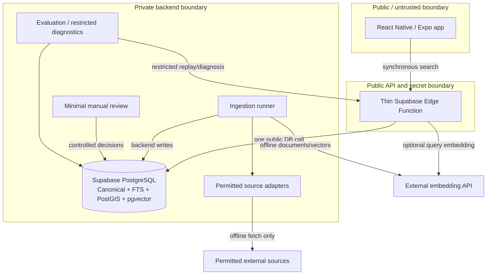

# Lemon Going-Out Search — Final Architecture v1.0

**Status:** `ARCHITECTURE_APPROVED`  
**Final independent score:** `9.620 / 10.000`  
**Scope:** Production-quality four-day vertical slice for the full Jönköping municipality  
**Architecture authority:** This document is the implementation-facing architectural source of truth.

## 1. Purpose

This document defines the approved Lemon Going-Out Search architecture that the Technical Specification, Implementation Plan, Codex Handoff, implementation, and verification must follow.

It fixes the difficult-to-reverse ownership, identity, lifecycle, search, security, failure, and extension boundaries. It deliberately leaves thresholds, candidate depths, model selection, and other measured ranking choices to the Technical Specification and implementation. It contains no implementation code or implementation task plan.

## 2. Executive Summary

The approved synchronous search path is:

> **React Native / Expo → thin Supabase Edge Function → optional multilingual query embedding → one public PostgreSQL search contract → independently diagnosable internal retrieval stages → canonical candidate union → protected exact behavior → fixed/simple RRF and deterministic relevance rank → relevance-primary broad-discovery non-collapse when applicable → public results.**

Supabase PostgreSQL is the canonical datastore and sole search datastore for the four-day trial. It owns canonical identities, Places, Events, external source history, targeted provenance, the Active Going-Out Taxonomy, versioned geographic scopes, PostGIS geometry, search documents, FTS data, pgvector embeddings, and minimal ingestion state. There is no secondary search engine, vector database, cache, event broker, or search-time source access.

The offline ingestion path is:

> **permitted source acquisition → capture/version → normalize/validate → deterministic or manual entity resolution → canonical and taxonomy update → search-document generation → embedding generation → publication.**

The architecture optimizes for truthful inventory, safe identity, English/Swedish search quality, deterministic degradation, and live diagnosability. It preserves future extension seams through stable canonical/source/taxonomy identities, evidence-grounded SearchDocuments, compatible vector contracts, independently defined retrievers, and one stable public search boundary—without building future infrastructure during the trial.

## 3. Scope and Fixed Product Decisions

### Geographic scope

The current scope is the **full Jönköping municipality**. The municipality boundary, timezone, source, licence, and version are stored as geographic configuration/data. Jönköping is not hardcoded into Place, Event, ingestion, or search semantics.

### Taxonomy coverage

Only the supplied **Active Going-Out Taxonomy** is valid for the trial. For every active leaf:

- target 5–10 unique legitimate published entities where real supply permits;
- when fewer legitimate entities exist, ingest all legitimate supply;
- report the leaf as `SUPPLY_CONSTRAINED` and retain the searched-source/run evidence;
- never fabricate entities, duplicate an entity to inflate coverage, or stretch adjacent classifications.

Coverage is a reproducible generated report, not a runtime subsystem.

### Events

Events are first-class entities. The four-day Event inventory is a deliberately bounded representative set of legitimate real upcoming Events. The architecture implements Event identity, venue linkage, standalone location, schedule, timezone, status, cancellation, expiry, deterministic time filtering, a configurable 30-day upcoming horizon, and a selected-source daily refresh target. Comprehensive Jönköping Event aggregation is not claimed and is deferred.

### Semantic provider

The trial has no Lemon-specific regional, vendor, or privacy restriction on the embedding provider. Provider/model choice is implementation-owned and must be supported by bilingual relevance, compatibility, latency, and operational evidence. Embeddings are the only launch AI dependency.

## 4. Architectural Principles and Invariants

1. **PostgreSQL is canonical.** Canonical truth is never owned by a client, model provider, or future search index.
2. **Mobile never dual-writes.** The mobile application calls the approved Edge search boundary and never writes canonical/search projections to multiple systems.
3. **Source identity and Lemon identity are separate.** External SourceRecords can change, conflict, disappear, or duplicate without redefining stable Lemon CanonicalEntity IDs.
4. **Place and Event lifecycles are separate.** A persistent destination and a scheduled occurrence never share state/expiry semantics merely because an Event occurs at a Place.
5. **Source disappearance is not Place closure.** Closure requires authoritative evidence or manual confirmation.
6. **Event state controls Event eligibility.** Cancelled, completed, expired, out-of-horizon, or conservatively withheld stale Events cannot surface through stale lexical/vector projections.
7. **Deterministic retrieval is model-independent.** Exact/alias, prefix, trigram, FTS, taxonomy, Event/time, and applicable geo paths remain available without an embedding.
8. **Semantic retrieval is additive.** It may improve discovery but cannot suppress deterministic retrievers or create canonical truth.
9. **Semantic failure degrades search rather than failing it.** The same database contract executes without a query vector.
10. **Eligibility precedes ranking protection.** Ineligible entities cannot be resurrected by names, aliases, FTS, or vectors.
11. **Eligible accent-preserving canonical exact is protected.** It remains above ordinary discovery evidence.
12. **Verified alias protection is conditional.** An exact alias is protected only when unambiguous within scope and non-conflicting with another active canonical name.
13. **Accentless exact and prefix are not protected.** They are strong ordinary evidence because normalization and prefix collisions are possible.
14. **No heuristic cross-source auto-merge exists during the trial.** Similar names, coordinates, addresses, domains, and phones create candidates for review, not automatic identity decisions.
15. **Taxonomy truth is evidence-bearing.** AI cannot create trial taxonomy membership.
16. **SearchDocuments are deterministic evidence-grounded projections.** They are rebuildable search inputs, never authoritative facts.
17. **Ingestion is rerunnable and idempotent.** Payload hashes, stable source keys, deterministic parsing, and transactional canonical updates distinguish new, changed, unchanged, invalid, and unresolved data.
18. **Search stages are independently diagnosable.** One network call does not permit one opaque SQL monolith.
19. **Broad discovery has a protected non-collapse invariant.** When similarly relevant alternatives exist, clearly broad top-K results cannot pathologically concentrate in one narrow taxonomy subtype, chain, or Event venue.
20. **Relevance remains primary over variety.** Non-collapse may reorder only sufficiently comparable relevant candidates and may not manufacture diversity with clearly weaker results.
21. **No request-time scraping or enrichment exists.** Source access, canonicalization, document generation, embeddings, and resolution occur offline.
22. **Future infrastructure does not alter canonical ownership.** ANN or a dedicated index may later consume projections, but PostgreSQL remains canonical and the client never dual-writes.

## 5. System Context and Trust Boundaries

The mobile application is untrusted and receives no database service-role key, embedding-provider key, or scraper credential. Edge owns public validation, correlation IDs, the optional query-embedding secret, provider timeout/fallback, and response shaping. PostgreSQL exposes one narrow executable search contract, not private source/evidence tables. Ingestion, manual review, and detailed diagnostics use separate backend/restricted privileges.

The deployment surfaces are the Expo application, Supabase database migrations/reference data, the Edge Function, an offline ingestion runner with source adapters, and an evaluation/diagnostic runner. Search-time source access does not exist.

## 6. Final Domain Model

| Concept | Identity and ownership | Lifecycle and invariants | Relationships |
|---|---|---|---|
| **CanonicalEntity** | Stable Lemon-owned public/search ID; immutable type `PLACE` or `EVENT` | Draft/validated/published/withheld/merged lifecycle; exactly one matching subtype; same names are allowed; merged entities are ineligible | Parent identity for Place/Event, aliases, taxonomy, source resolution, provenance, SearchDocument |
| **Place** | One-to-one subtype owned by Lemon | Persistent destination state, point/address, official contact fields, optional normalized opening hours; disappearance alone never closes it | May host Events; belongs to one publication scope/boundary version |
| **Event** | One-to-one subtype owned by Lemon | Scheduled occurrence with start/end/timezone/status; cancellation, completion, expiry, horizon, freshness, and interval overlap control eligibility | Optionally links to a Place; otherwise retains sufficient standalone venue/location evidence |
| **GeographicScope** | Stable scope ID/slug and versioned boundary owned as reference data | Active/inactive scope configuration; boundary changes require revalidation | Canonical entities carry assigned scope and boundary version; points validated with PostGIS |
| **Source** | Stable registry identity for a permitted external source/adapter | Enabled only after terms/licence/access/persistence review; revocable | Owns SourceRecords and ingestion runs |
| **SourceRecord** | Stable `(source, external_key)` identity | First/last seen, current version, miss state, optional resolved CanonicalEntity; at most one current entity resolution | Owns immutable versions; many records can support one canonical entity |
| **SourceRecordVersion** | Immutable observation identified by record and content hash | Created only for changed permitted payload/extracted envelope; parser/fetch metadata retained | Supports last-good recovery, targeted provenance, taxonomy evidence, and revocation analysis |
| **CanonicalFactProvenance** | Targeted link from a constrained critical fact to one SourceRecordVersion | Current selection changes explicitly; not a general evidence graph | Used for canonical name, geo/scope, Event schedule/status, displayed/used hours, and other approved eligibility-critical facts |
| **Alias** | Lemon entity alias with normalized forms, language/type, and evidence | Verified/unverified/inactive lifecycle; exact protection requires unambiguous verified state | Supports exact, prefix, trigram, and FTS retrieval |
| **DuplicateCandidate** | Stable candidate pair/source-entity pair | `OPEN`, `SAME`, `SEPARATE`, or `UNSURE`; records evidence summary and manual outcome | Similarity writes here; approved outcomes may relink sources/entities transactionally |
| **TaxonomyNode** | Stable Active Taxonomy ID/slug | Hierarchical, bilingual, active-state and checksum/version semantics; acyclic | Parent/child hierarchy, aliases, multi-label memberships |
| **TaxonomyAlias** | Node synonym in EN/SV with normalized forms | Active/inactive reference data | Enables deterministic category recognition |
| **EntityTaxonomyMembership** | Entity-node relationship owned as canonical classification | Only `SOURCE_FACT`, `DETERMINISTIC_MAP`, or `MANUAL`; active membership requires evidence | Multi-label; direct membership distinguished from descendant expansion |
| **SearchDocument** | Versioned deterministic projection per CanonicalEntity | Rebuilt on relevant canonical/taxonomy/template change; content-hashed; never truth | Drives weighted FTS and Embedding generation; future external-index seam |
| **Embedding** | Vector tied to a SearchDocument and compatible model contract | Active only for matching model/version/dimension/document hash | Exact pgvector retrieval at current scale; parallel re-embedding supports migrations |
| **IngestionRun** | Source/scope/adapter execution summary | Started/succeeded/failed/partial with essential counts and last-success evidence | Links source versions and operational diagnosis |

No generic SourceAssertion, CanonicalFieldSelection, subjective DerivedAttribute, universal policy engine, or generalized merge-history subsystem is part of the approved model.

## 7. Final Logical PostgreSQL Model

Columns below are logical, not implementation SQL. Every mutable canonical/reference table carries appropriate `created_at`/`updated_at`; observations carry `observed_at`; status values and normalization functions are version-controlled.

| Table | Purpose and important fields | PK / FKs / uniqueness | Key indexes and lifecycle semantics |
|---|---|---|---|
| `geographic_scopes` | Scope configuration: `id`, stable `slug`, type, EN/SV name, IANA timezone, active state | PK `id`; unique `slug` | Active/slug lookup; adding cities is data/configuration |
| `geographic_scope_boundaries` | Versioned boundary: `id`, `scope_id`, version, `geometry(MultiPolygon,4326)`, source/licence, effective dates, active state | PK `id`; FK scope; unique `(scope_id, version)`; at most one active boundary/scope | GiST geometry; active/effective lookup; boundary change triggers explicit revalidation |
| `canonical_entities` | Stable identity: `id`, immutable type, canonical name, normalized accent-preserving/accentless names, publication status, `scope_id`, `scope_boundary_id`, optional `merged_into_id`, published time | PK `id`; FKs scope/boundary/self-merge; exactly one subtype; no self/cyclic merge; **name is not unique** | Partial B-tree exact/prefix indexes by active scope; publication/type indexes; merged entities ineligible |
| `places` | Place subtype: `entity_id`, geography point, address, official URL/domain, phone, Place status, optional normalized opening-hours value/status/timezone, last authoritative observation | PK/FK `entity_id`; type check; published Place requires valid point and non-blocking state | GiST point; status/domain indexes; closure requires authoritative/manual evidence |
| `events` | Event subtype: `entity_id`, optional `venue_place_id`, standalone venue/location/point, starts/ends, source timezone, status, status/last-source observations | PK/FK `entity_id`; FK venue Place; end ≥ start; published Event requires schedule and venue/location evidence | Partial B-tree eligible `(status, starts_at, ends_at)`; GiST standalone point; cancellation/expiry immediately removes eligibility |
| `sources` | Source registry: `id`, stable key, kind, reference/base URL, licence/terms/attribution, access/persistence policy, adapter version, enabled state | PK `id`; unique source key | Enabled-state lookup; enabling requires reviewed source-policy fields |
| `source_records` | External identity: `id`, `source_id`, stable external key, canonical URL, optional `canonical_entity_id`, resolution method, first/last seen, current version, miss count/state | PK `id`; FKs source/entity/current version; unique `(source_id, external_key)` | Entity, resolution, current-version, last-seen indexes; missing observation never directly closes Place |
| `source_record_versions` | Immutable changed observation: `id`, `source_record_id`, permitted payload/extracted envelope, content hash, parser version, fetch metadata, observed time, `ingestion_run_id` | PK `id`; FKs record/run; unique `(source_record_id, content_hash)` | Record/time and run indexes; unchanged hash creates no new version; invalid versions do not replace last-good truth |
| `canonical_fact_provenance` | Critical-fact trace: `id`, `entity_id`, constrained fact key, `source_record_version_id`, resolution method, selected time, optional note | PK `id`; FKs entity/version; one current selection per singular `(entity_id, fact_key)` | Entity/fact and source-version indexes; only identity/eligibility/schedule/status/display-critical keys |
| `entity_aliases` | Search aliases: `id`, `entity_id`, alias, normalized/accentless values, language, type, evidence source/manual method, verification/active state | PK `id`; FKs entity/evidence; dedupe `(entity_id, normalized_alias)` | Exact/prefix B-tree, trigram, entity/state indexes; verified does not imply protected until query-time ambiguity checks pass |
| `duplicate_candidates` | Manual resolution queue/audit: candidate entity/source pairs, evidence summary, status, reviewer, resolution time, optional survivor | PK `id`; FKs involved records/entities/survivor; normalized pair uniqueness | Open-status and involved-entity indexes; similarity can create/update candidate but never auto-merge |
| `taxonomy_nodes` | Active hierarchy: `id`, stable slug, `parent_id`, EN/SV labels, depth/path, leaf flag, active state, checksum/version | PK `id`; self-FK parent; unique active slug; acyclic same-version hierarchy | Parent/path/active indexes; only active nodes can support published membership |
| `taxonomy_aliases` | Category synonyms: `id`, `taxonomy_node_id`, language, synonym, normalized/accentless values, active state | PK `id`; FK node; unique `(node_id, normalized_alias)` | Exact normalized lookup; optional prefix/trigram only when evaluation justifies it |
| `entity_taxonomy_memberships` | Evidence-bearing multi-label truth: entity, node, method, evidence source record/version, optional automated confidence, active state | Composite PK or surrogate plus unique active `(entity_id, node_id)`; FKs entity/node/evidence | Node/entity/active indexes; AI is not an allowed truth method; direct membership distinguishable from ancestor expansion |
| `search_documents` | Rebuildable lexical/semantic projection: `id`, `entity_id`, deterministic text fields, content hash, template/language version, weighted stored FTS vector, generated/active state | PK `id`; FK entity; unique entity/template/content contract; one active document/entity/template | GIN `tsvector`; active/entity/hash indexes; stale on relevant canonical/template changes |
| `embeddings` | Compatible vector projection: `id`, `search_document_id`, entity, provider/model/version/dimension/metric, vector, document hash, generated time, active state | PK `id`; FKs document/entity; unique document+model contract; active compatibility constraint | Exact pgvector scan; model/document/state lookup; **no ANN index in trial** |
| `ingestion_runs` | Minimal operational summary: `id`, source, scope, adapter/parser version, start/end/state, counts, last-success marker, bounded error summary | PK `id`; FKs source/scope | Source/start/state indexes; captures fetched, valid/invalid, new/changed/unchanged, unresolved, published |

Search configuration is a small versioned configuration artifact or compact configuration row—not a framework. It may hold the active search/document/model versions and the implementation-owned thresholds listed later. A dedicated configuration table family is not required.

## 8. Source and Provenance Architecture

The source chain is:

> **Source → SourceRecord → SourceRecordVersion → resolved CanonicalEntity**

`Source` defines permission, access, licence/attribution, and adapter ownership. `SourceRecord` preserves the external identity and observation state. `SourceRecordVersion` preserves each changed permitted observation and parser/fetch context. The canonical row represents Lemon's current published decision.

Targeted provenance answers “Where did this important fact come from?” for:

- canonical name and other identity-critical facts;
- coordinates and scope eligibility;
- Event start/end/status/cancellation;
- opening hours when displayed or used for behavior;
- other explicitly approved public eligibility-critical facts.

Taxonomy evidence lives on `entity_taxonomy_memberships`. SearchDocument text is reproducible from canonical and source-backed inputs. Non-critical phone, URL, and factual description history may be understood through the supporting SourceRecordVersion rather than receiving generic field-level rows.

Source precedence is fact-specific:

- current official venue/organizer evidence normally wins self-declared name, hours, and Event schedule/status;
- municipal sources normally win official municipal-asset and boundary facts;
- a source's stable ID owns only that source-record identity, not universal canonical truth;
- no source has universal precedence;
- coordinate conflicts are not averaged;
- material conflicts remain preserved in versions and enter manual review or block publication when truth/eligibility is uncertain.

Source revocation disables future use, identifies all affected SourceRecords and canonical entities, locates critical facts for which the source is sole evidence, and triggers re-resolution/re-ingestion or reviewed unpublication. It does not require a generalized evidence graph.

## 9. Entity Resolution and Deduplication

Automatic linking is permitted only for deterministic identity evidence:

1. the same `(source_id, stable_external_key)`;
2. an explicit stable identifier genuinely shared across sources;
3. a manually approved known cross-source mapping reused on later runs.

Name, address, coordinates, domain, and phone similarity may create or strengthen a `DuplicateCandidate`. They cannot automatically merge or link entities during the trial. The governing bias is:

> **temporary duplicate > destructive false merge**

Minimal manual resolution records the candidate, evidence summary, reviewer, decision (`SAME`, `SEPARATE`, or `UNSURE`), and time. A manual `SAME` decision is applied transactionally: lock involved records/entities, recheck current state, select a survivor, relink approved SourceRecords/aliases/memberships, mark the loser merged/ineligible, regenerate the survivor SearchDocument/Embedding, and retain the decision. Source keys and transaction locks prevent ingestion races from producing independent identity changes.

Source records and immutable versions remain intact, allowing a mistaken manual resolution to be corrected through a controlled reassignment/republication operation. A future precision-proven resolver can consume the same candidates, evidence, and human outcomes, abstain on uncertainty, and preserve the same canonical/source contracts.

## 10. Taxonomy Architecture

The Active Going-Out Taxonomy is stored as stable hierarchical bilingual data:

- stable node IDs/slugs and parent/child relationships;
- English and Swedish labels;
- English/Swedish aliases and synonyms;
- active state plus taxonomy checksum/version metadata;
- multi-label entity membership;
- membership methods `SOURCE_FACT`, `DETERMINISTIC_MAP`, and `MANUAL` with evidence.

AI does not create trial taxonomy truth. An exact EN/SV label or alias can identify a node deterministically. A parent query expands to active descendants. Direct leaf membership ranks ahead of an entity included only through descendant/ancestor expansion. Narrow explicit taxonomy queries retain their category constraint and are not diversified into unrelated categories.

For each active leaf, a generated versioned coverage report records boundary version, target 5–10, actual unique published entity count, evaluation time, sources/runs searched, and one status: `COMPLETE`, `SUPPLY_CONSTRAINED`, or `NEEDS_VALIDATION`. Scarcity remains visible and truthful.

## 11. Ingestion Architecture

The approved pipeline is:

> **fetch → capture/version → normalize/validate → deterministic/manual entity resolution → canonical + taxonomy update → search document + embedding + publication**

| Stage | Responsibility | Idempotency | Retry, failure, and last-good behavior |
|---|---|---|---|
| **Fetch** | Execute an enabled adapter within terms, robots/access rules, quotas, and credential boundaries | Source cursor/snapshot and stable external keys | Retry bounded transient failures offline; a failed fetch changes no canonical data |
| **Capture/version** | Upsert SourceRecord and store a permitted immutable version only when content changes | Unique source+external key and record+content hash classify new/changed/unchanged | Retain raw only when permitted; otherwise retain URL/hash/metadata/permitted extracted envelope; failed capture blocks later stages |
| **Normalize/validate** | Deterministically parse a version into a typed Place/Event candidate and validate completeness/types/ranges | Parser version plus source version produces reproducible output | Invalid or parser-regressed output is recorded in run diagnostics and never replaces last-good canonical truth |
| **Deterministic/manual resolution** | Reuse deterministic source identity/approved mapping, create a new entity, or open a duplicate candidate | Prior source resolution and approved candidate outcomes are reused | Similarity never writes identity; ambiguous records remain unresolved and unpublished until reviewed where necessary |
| **Canonical + taxonomy update** | Apply explicit field-specific precedence, targeted provenance, scope assignment, subtype state, and memberships | Transactional upsert keyed by canonical/source identities | Material conflicts may block/review; a transaction failure leaves prior canonical state intact |
| **Document + embedding + publication** | Build deterministic SearchDocument, compatible vector, and final eligibility/publication state | Document content hash and model contract skip unchanged work | Embedding failure does not block deterministic publication when all required non-semantic truth is valid; missing critical truth blocks publication |

Run classification is explicit:

- **new:** unseen stable SourceRecord identity;
- **changed:** existing record with new content hash;
- **unchanged:** existing record with known content hash;
- **invalid:** parsing/validation failed; retain last-good canonical state;
- **unresolved duplicate:** similarity/identity ambiguity requires review;
- **disappeared:** absent from a source snapshot or repeatedly unobserved; update miss/observation state, never infer Place closure automatically.

## 12. SearchDocument and Embedding Architecture

`SearchDocument` is deterministic, evidence-grounded, rebuildable, content-hashed, and template/language-versioned. One active document per entity contains only approved search evidence:

- canonical name and verified aliases;
- EN/SV taxonomy labels and approved aliases;
- explicit cuisine, activity, category, and facility facts;
- permitted factual source descriptions or conservative normalized summaries;
- factual municipality/area context;
- for Events, title, type, venue, and factual date/time context.

It excludes invented marketing prose and generated canonical labels such as `cozy`, `romantic`, `quiet`, `lively`, `inexpensive`, `working-friendly`, or similar unsupported subjective truth. A user's subjective natural-language query may still match factual evidence semantically; the system does not manufacture the attribute as canonical data.

One active multilingual vector space serves documents and queries. Every Embedding records provider, model/revision, dimension, metric, SearchDocument hash/template, and generation time. An embedding is eligible only when its contract matches the active query-vector contract. Provider/model migration creates a parallel re-embedded set, evaluates it, and atomically changes the active compatible set. Incompatible vector spaces are never compared or hot-swapped.

At the trial catalogue size, pgvector uses exact cosine retrieval. ANN is not present.

## 13. Public Search Architecture

The request path is:

> **Mobile → Edge → optional query embedding → one PostgreSQL public search call**

The conceptual request contains:

- non-empty trimmed query text within a fixed maximum length;
- UI locale as a presentation preference, not an assumption about query language;
- configured/derived `scope_id`;
- optional consented point/radius and supported structured filters;
- optional explicit taxonomy node;
- bounded result limit/pagination semantics;
- server-controlled current time for Event behavior, with injected time only in tests.

Edge validates length, coordinates, limits, filters, and scope; creates a request ID; performs deterministic taxonomy/time recognition; decides only whether an embedding is worth requesting; enforces provider deadline/fallback; calls the database once; and shapes public cards.

The response exposes result cards, request ID, bounded pagination/limit metadata, and a coarse degraded indicator. It does not expose internal scores, candidate traces, provenance internals, provider errors, source payloads, or backend secrets.

There is no general `QueryRouter`, mode classifier, LLM router, or retriever-suppression mechanism. All cheap deterministic paths remain available. Only semantic invocation is conditional.

## 14. Internal Search Stages

The public database contract orchestrates nine independently inspectable/testable stages. They may be implemented as disciplined helper functions, views, or named CTE units; their inputs, outputs, and diagnostic boundaries are protected.

| Stage | Responsibility and conceptual I/O | Principal mechanism | Restricted diagnostic responsibility |
|---|---|---|---|
| `eligibility` | Request context + entities → eligible canonical universe | Publication/scope/subtype state, Event interval/status/horizon, explicit filters/radius | State whether entity exists, which rule admitted/filtered it, and relevant scope/Event state |
| `exact_candidates` | Normalized query + eligible universe → canonical/alias exact list and accentless fallback | B-tree normalized canonical/alias lookup | Match type, ambiguity/conflict qualification, protected-tier eligibility, stage rank |
| `fuzzy_candidates` | Query → prefix/trigram candidate ranks | Pattern-capable B-tree + bounded `pg_trgm` | Prefix/trigram path, similarity evidence, threshold/candidate cutoff, stage rank |
| `lexical_candidates` | Query terms → weighted lexical list | Stored weighted `tsvector` + GIN over names, aliases, taxonomy, facts, factual descriptions | FTS rank and matched weighted field class |
| `taxonomy_candidates` | Recognized node/filter → direct and descendant candidates | Taxonomy alias lookup and membership hierarchy joins | Recognized node, direct versus expanded membership, stage rank |
| `event_candidates` | Event/time evidence → eligible Event list | Deterministic EN/SV time interval + Event status/time indexes + lexical venue/title evidence | Parsed interval/timezone, status/freshness, venue relationship, stage rank |
| `semantic_candidates` | Optional valid query vector → compatible entity ranks | Exact pgvector cosine scan over active compatible embeddings | Attempt/status/model contract, vector compatibility, stage rank; no candidate path when vector absent |
| `fuse_candidates` | All stage lists → canonical union preserving per-stage ranks/evidence | Deduplicate by CanonicalEntity ID; retain every participating rank | Candidate presence in union and each contributing list/rank |
| `rank_results` | Union + protected evidence + constraints → final ordered public results | Protected exact tier; fixed/simple RRF for ordinary lists; deterministic tie/context rules; conditional broad non-collapse; projection | Original/final rank, RRF contributions, exact qualification, final tie/context evidence, non-collapse movements/reasons |

Every retriever consumes the eligible canonical universe or rechecks the same eligibility predicate. SearchDocuments or vectors cannot bypass canonical subtype state.

## 15. Known-Item Retrieval

Final precedence is:

1. **eligible accent-preserving normalized canonical exact — protected;**
2. **eligible accent-preserving verified alias exact — protected only when it maps to exactly one eligible entity within scope and conflicts with no other active canonical name;**
3. **accentless exact — strong ordinary evidence;**
4. **prefix — strong ordinary evidence;**
5. **trigram, FTS, taxonomy, Event, and semantic evidence;**
6. **ordinary discovery ranking.**

Eligibility executes first. A closed/withheld/out-of-scope Place or cancelled/expired/out-of-window Event is absent regardless of exact text.

Canonical names are not unique. Legitimate same-name eligible entities all enter the canonical-exact protected tier; explicit type/category/geo context and deterministic tie-breaking may order them. An alias collision prevents alias protection and leaves the candidates in ordinary relevance ranking. A chain name does not collapse distinct outlets into one identity, and prefix evidence for a longer chain/outlet name cannot defeat a canonical exact match merely because it is strong.

## 16. Fuzzy and Lexical Retrieval

### Prefix

Prefix retrieval uses normalized accent-preserving names/aliases and a pattern-capable B-tree strategy. Minimum length and candidate depth are bounded tunables. Prefix never becomes an absolute protected tier.

### `pg_trgm`

Trigram retrieval supplies bounded typo, spacing, and common transposition candidates over canonical names and aliases. Conservative minimum-length and threshold rules protect short/common Swedish and English tokens. Full-catalog Levenshtein is not required; it may be considered only if measured failures show a specific benefit.

### FTS

Stored weighted FTS searches canonical names, aliases, taxonomy labels/aliases, explicit structured facts, and permitted factual descriptions. Names and verified aliases receive greater weight than taxonomy/facts, which receive greater weight than descriptions.

SearchDocument construction keeps English, Swedish, and safe mixed/entity tokens available through an approved English/Swedish/`simple` strategy. Query language is not inferred solely from UI locale. FTS complements name typo retrieval; it is not a second uncontrolled fuzzy subsystem.

## 17. Taxonomy and Structured Retrieval

Exact EN/SV taxonomy labels and approved aliases are recognized deterministically. A query for a parent includes entities with active membership in its descendants. Direct membership at the requested leaf ranks above an entity reached only through hierarchy expansion. Multi-label membership permits legitimate cross-category discovery without copying entities.

Taxonomy retrieval always applies publication, scope, subtype, Event state/time, and explicit geo filters. An explicit narrow taxonomy request—such as `Italian restaurants`, `padel`, or `cocktail bars`—retains its category semantics. The broad-discovery non-collapse step cannot inject unrelated categories to manufacture variety.

## 18. Semantic Retrieval

Semantic retrieval embeds the normalized query in the same active multilingual vector space as evidence-grounded SearchDocuments and performs an exact pgvector similarity scan over compatible eligible entities.

Semantic invocation is normally appropriate for broad, occasion, mixed-intent, or uncertain queries. High-confidence name-shaped queries and explicit taxonomy-only queries normally avoid the provider call. This is a bounded cost heuristic, not a general query router; all deterministic retrievers still execute.

Semantic candidates:

- remain subject to the same hard scope, type, Event/time, radius, and publication eligibility;
- cannot defeat protected canonical/qualifying alias exact behavior;
- cannot create taxonomy membership, subjective truth, or unsupported facts;
- contribute through rank-level fusion rather than raw cosine addition.

The provider call uses a bounded sub-deadline inside the semantic latency budget and has no default in-request retry. Timeout, rate limit, provider error, circuit-open state, invalid dimension, non-finite vector, or model mismatch causes the same database search call with no query vector. Exact/alias, prefix, trigram, FTS, taxonomy, Event/time, and geo remain operational. There is no LLM router, query rewriter, LLM reranker, or generated result explanation.

## 19. Fusion and Ranking

The final architecture is:

> **candidate lists → canonical union → protected exact handling → fixed/simple RRF and deterministic relevance rank → broad-discovery non-collapse when applicable → result projection**

Each ordinary retriever contributes its candidate rank through fixed/simple Reciprocal Rank Fusion, conceptually `1 / (k + rank)`. Rank-level fusion is used because trigram, FTS, taxonomy, Event, and cosine scores are not naturally calibrated against one another. Protected exact sits above ordinary fusion; hard constraints sit above all ranking.

RRF has very few parameters. There is no per-query-family weight matrix, raw-score normalization/calibration infrastructure, learned-to-rank model, or generalized diversity objective. Bounded deterministic evidence—such as direct taxonomy membership, requested geo/time context, and stable tie-breaks—may order otherwise comparable ordinary candidates without crossing the protected exact boundary.

## 20. Broad-Discovery Non-Collapse

For clearly broad discovery:

> **Final top-K must not pathologically concentrate in one narrow taxonomy subtype, chain, or Event venue when sufficiently similarly relevant alternatives exist.**

The adjustment is part of `rank_results` and executes only after eligibility, all candidate retrieval, canonical union, protected exact handling, and ordinary relevance ranking. It uses existing deterministic query evidence and final-ranking context to determine whether a query is clearly broad; it does not introduce a new router or suppress any retriever.

Protected behavior:

- relevance remains primary;
- only already eligible, independently retrieved, relevant candidates may move;
- a candidate may move only within an implementation-defined sufficiently comparable relevance cohort;
- clearly weaker results cannot be promoted merely for variety;
- known-item/navigational queries never run the adjustment;
- narrow explicit taxonomy queries never receive forced cross-category diversity;
- if no similarly relevant alternatives exist, truthful concentration remains;
- behavior is deterministic for the same request, corpus, clock, and search configuration;
- restricted diagnostics expose applicability, grouping reason, every moved result, original rank, and final rank.

The protected failure cases include five parks for `things to do`, five cafés for generic discovery, several Events from one venue consuming top-K, or several outlets of one chain consuming a broad top-K despite similarly relevant alternatives.

Taxonomy grouping uses existing hierarchy/membership at an implementation-selected stable comparison level. Event grouping uses the existing Event-to-Place relationship. Chain grouping uses only an unambiguous existing inventory/configuration key and abstains when that relationship is unknown; it never infers canonical identity.

The concentration limit, comparable-relevance rule, taxonomy level, chain/Event-venue repetition limit, and cap-versus-interleaving algorithm are tunables. No generalized diversity subsystem, MMR requirement, optimizer, model, service, or table is introduced.

## 21. Geographic Architecture

The current scope is the full Jönköping municipality. `geographic_scope_boundaries` stores the versioned source/licensed MultiPolygon in SRID 4326, while Place/Event locations use PostGIS points/geography appropriate to distance operations.

At ingestion/publication:

> **point → active municipality-boundary check → assigned `scope_id` + boundary version**

Ordinary search filters the assigned `scope_id`; it does not repeatedly evaluate the municipality polygon. Query-time spatial work is used only for explicit radius, near-me, distance sorting, or boundary revalidation. Boundary updates trigger explicit revalidation/republication rather than silently changing historical scope truth.

Stockholm or another city adds a scope row, boundary version, timezone, permitted sources, inventory, coverage report, and evaluation slice. CanonicalEntity, Place, Event, SourceRecord, and public search contracts do not change.

## 22. Event Architecture

Event remains separate from Place and carries:

- stable Lemon identity;
- optional linked Place or sufficient standalone venue/location;
- source timezone and canonical UTC start/end;
- status and status observation;
- cancellation, completion, expiry, horizon, and freshness semantics;
- targeted schedule/status provenance;
- a deterministic time-filtering contract.

The configurable trial window is `now` through `now + 30 days`, evaluated in the scope timezone (`Europe/Stockholm` for Jönköping) and converted to explicit UTC intervals with IANA DST rules. The supported deterministic EN/SV vocabulary covers at least tonight/this evening/`ikväll`, tomorrow/`imorgon`, weekday forms, this Friday/`på fredag`, this weekend/`i helgen`, and next weekend/`nästa helg`. Time is injectable in tests.

| Situation | Approved behavior |
|---|---|
| Venue exists but Event expired | Place remains searchable; Event is excluded |
| Event has no known Place | Publish only with sufficient standalone venue/location evidence; link later without changing Event ID |
| Same occurrence appears in multiple sources | Deterministic shared ID/approved mapping only; otherwise DuplicateCandidate/manual review |
| Schedule changes | New SourceRecordVersion updates canonical schedule/provenance and rebuilds document/vector |
| Event is cancelled | Canonical state becomes cancelled; eligibility removes it immediately; evidence remains |
| Status/source is stale | Apply explicit freshness tolerance; near-term stale Events may be withheld conservatively |
| Recurring series | Ingest concrete occurrences exposed by selected sources; no recurrence engine |

Selected Event sources target daily refresh, and deterministic expiry removes past occurrences even when a source refresh fails. Inventory is representative and bounded, not comprehensive.

## 23. Reliability and Degraded Behavior

| Failure/state | Required behavior |
|---|---|
| Embedding timeout/outage/rate limit/circuit open | Call the same DB search contract without a vector; record degraded semantic status; deterministic search remains available |
| Invalid/non-finite/wrong-dimension/model-mismatched vector | Reject the vector; never compare incompatible spaces; continue deterministic search |
| Parser regression/incomplete parse | Mark invalid/run failure, retain last-good canonical fields/projections, and expose count/completeness change |
| Source disappearance | Update miss/observation state; do not close Place automatically; investigate authoritative/manual evidence |
| Stale Event source | Apply source freshness policy; withhold near-term uncertain Events when necessary; deterministic expiry still runs |
| Event cancellation | Update status/provenance and exclude immediately despite stale FTS/vector content |
| Event expiry/completion | Eligibility excludes occurrence; linked Place remains independent |
| Duplicate candidate | Preserve both legitimate identities until deterministic/manual resolution; never heuristic auto-merge |
| Taxonomy scarcity | Publish legitimate supply and report `SUPPLY_CONSTRAINED`; do not stretch classification |
| Invalid or conflicting source record | Preserve immutable evidence; block its canonical update or route material conflict to review; last-good truth remains |
| Failed ingestion rerun | Transactional stages prevent partial canonical corruption; run state and counts identify failure; rerun reuses stable keys/hashes |

## 24. Security Architecture

- **Edge is the public trust boundary.** It validates query length, locale/scope, coordinates, radius, filters, limits, and provider responses; issues request IDs; holds the optional provider secret; and shapes responses.
- **Mobile receives no privileged secrets.** Database service-role keys, provider credentials, source credentials, and review privileges remain backend-only.
- **Backend/evidence tables are private by default.** Anonymous/authenticated roles do not read SourceRecordVersions, provenance, raw permitted captures, duplicate evidence, provider diagnostics, or detailed traces.
- **The search role is narrow.** It may execute one shaped public search function and receive only public result fields.
- **`SECURITY DEFINER` is conditional.** Use it only when the function must read private projections; revoke default `PUBLIC` execute, grant only the API role, use a fixed/controlled `search_path`, schema-qualify objects, validate every argument, and avoid unsafe dynamic SQL.
- **Ingestion/review/diagnostic access is separated.** Backend writers and restricted evaluators do not share the mobile/public role.
- **Anonymous discovery uses proportional controls.** Platform/gateway limits, maximum query/result/candidate bounds, and safe validation are sufficient initially; a custom rate-limit service requires observed need.
- **Logs are minimized/redacted.** Do not retain authorization, secrets, provider payloads, precise user coordinates, or raw query text by default.

## 25. Observability and Diagnostics

Four-day search telemetry records only:

- request ID;
- semantic attempted and status: success, timeout/failure, circuit open, or not attempted;
- Edge, embedding-provider, database, and overall backend latency;
- result count;
- candidate count by main retriever;
- active search, SearchDocument, and embedding model versions.

Four-day ingestion telemetry records only:

- source and run ID;
- fetched and valid/invalid counts;
- new/changed/unchanged counts;
- unresolved duplicate count;
- published count;
- last successful refresh.

Restricted diagnostics must answer: **Why did entity X not reach top five?** They expose:

- whether the entity exists and passed eligibility;
- which candidate stages returned it and its rank in each;
- its presence/rank in canonical union and ordinary fusion;
- whether canonical/alias exact protection qualified and why;
- the hard condition that filtered it, if any;
- active search/document/model versions;
- when broad non-collapse is considered: broad applicability evidence, whether it changed order, concentration reason (`taxonomy_subtype`, `chain`, `event_venue`), grouping key, moved entity, original rank, final rank, and comparable-relevance qualification.

Detailed traces are restricted and ephemeral; they are not public response fields or persisted in production by default. Sophisticated dashboards, alert hierarchies, long-term candidate traces, and query analytics are not part of the trial architecture.

## 26. Evaluation Architecture

The evaluation corpus is a versioned artifact independent of ranking code. It pins the canonical corpus/scope boundary, taxonomy, judgments, server clock, normalization/document template, embedding model, and search configuration.

| Split | Size | Use |
|---|---:|---|
| Development | 60 | Inventory, normalization, retrieval, semantic, and ranking tuning |
| Sealed held-out | 30 | Remains sealed until a candidate configuration is frozen |
| Adversarial | 20 | Scope/state/duplicate/scarcity/short-name/language/provider and concentration failures |

The 110 queries cover canonical exact, verified aliases, prefix, typo/transposition/spacing, taxonomy parent/leaf, broad discovery, semantic intent, English, Swedish, mixed language, Event/time, geographic, scarcity, duplicates, cancellation/expiry, and other state failures. Translation pairs and close paraphrases remain in the same split. The semantic subset contains at least 12 paired EN/SV intents (24 queries) plus six mixed/adversarial semantic queries within the fixed 110-query total.

Metrics:

| Concern | Metric |
|---|---|
| Known item | Hit@1, Hit@3, MRR where useful |
| Candidate retrieval | Recall@20 |
| Visible ranking | Precision@5, NDCG@5 |
| Semantic | Lexical-only versus hybrid, reported separately for English and Swedish |

Broad-discovery cases include `things to do`, `something fun`, `something fun tonight`, `något roligt`, broad Activities & Experiences, and cases where one subtype has materially deeper inventory. Evaluation preserves Precision@5/NDCG@5 and explicitly inspects top-five subtype/chain/Event-venue distribution before and after any adjustment. The acceptance assertion is that broad discovery must not show pathological concentration when multiple similarly relevant alternatives exist. No complex diversity metric is required.

Every failure is attributed to one of: missing inventory; normalization/alias; dedupe; taxonomy; deterministic interpretation; candidate retrieval; semantic representation; fusion/rank; or eligibility/Event state. Stage diagnostics supply the evidence. Sealed held-out results are not iteratively tuned against.

## 27. Performance and Scale Posture

Performance values are trial targets to benchmark, not achieved claims:

| Search type | p50 backend target | p95 backend target |
|---|---:|---:|
| Direct/category | ≤ 100 ms | ≤ 300 ms |
| Semantic | ≤ 750 ms | ≤ 1.5 s |

Measure Edge, provider, database, overall backend, client-perceived, and cold-start latency separately.

Scale evolution:

- **~1K entities:** PostgreSQL-only; bounded B-tree/trigram/GIN/PostGIS retrieval; exact pgvector scan.
- **~10K:** likely unchanged; measure p95, resource usage, candidate bounds, and plans.
- **~100K:** benchmark exact vectors against HNSW, trigram/FTS plans, filtered recall, rebuild/write costs, and Recall@20.
- **~1M/high QPS:** consider ANN, partitioning/read replicas/cache, or a dedicated search engine only after measured latency, throughput, relevance, or maintainability failure under reasonable PostgreSQL tuning.

A future engine receives versioned SearchDocuments through a future canonical-commit → outbox → projector → reconciliation/full-rebuild path. That infrastructure is not built now. PostgreSQL remains canonical and mobile never dual-writes.

## 28. Four-Day vs Extension Matrix

| Capability | Protected Core | Four-Day Implementation | Future Extension |
|---|---|---|---|
| Canonical identity | Stable Lemon ID separate from sources; immutable entity type | Minimal CanonicalEntity + Place/Event subtype state | New service-specific subtypes only where lifecycle truly differs |
| Sources/provenance | Source → record → changed version; critical facts explainable | Source registry, versions, targeted fact provenance, membership evidence | Richer conflict/revocation workflow only for demonstrated operational need |
| Deduplication | Stable source/canonical separation and DuplicateCandidate contract | Deterministic auto-link; manual all other cross-source decisions | Precision-proven conservative resolver consumes candidates/outcomes |
| Taxonomy | Stable hierarchical bilingual IDs; multi-label evidence-bearing membership | Active Going-Out tree, EN/SV aliases, source/deterministic/manual membership | Additional releases and broader service trees retain stable mapping semantics |
| Fuzzy search | Independent exact/prefix/trigram boundaries | B-tree exact/prefix and bounded `pg_trgm` | Analyzer/autocomplete refinements based on evaluation |
| FTS | Evidence-weighted lexical projection | Stored weighted EN/SV/simple `tsvector` + GIN | Field/analyzer evolution without canonical rewrite |
| Semantic | Compatible vector contract; deterministic independence | One multilingual document/query space; exact pgvector | Multiple representations, alternate provider, reranker under controlled evaluation |
| Ranking | Eligibility, protected exact, candidate/fusion boundary | Fixed/simple RRF and bounded deterministic final rank | Calibrated/richer deterministic, behavioral, personalized, or LTR ranking |
| Broad non-collapse | Relevance-primary invariant inside final rank | One small deterministic broad-only cap/interleave/repetition rule | Richer explicit diversity objectives only with evidence |
| Geography | Versioned scopes/boundaries and PostGIS points | Publication-time Jönköping scope assignment; radius/distance on demand | Additional cities/countries and richer geo signals |
| Events | Separate schedule/status/cancellation/expiry lifecycle | Bounded real 30-day inventory; selected-source daily refresh | More adapters, faster refresh, recurrence/ticketing when justified |
| Subjective attributes | Optional future evidence-bearing/non-authoritative seam | Not generated or stored as canonical truth | Add only with evidence, model/version, review, and measured value |
| Automated entity resolution | Candidate/evidence/outcome seam | None beyond deterministic identities | Conservative precision-proven automation with abstention/audit/rollback |
| HNSW/ANN | Embedding and vector retrieval interface | Exact scan; no ANN index | Add HNSW after representative latency/resource/Recall@20 evidence |
| Dedicated search engine | PostgreSQL canonical ownership + versioned SearchDocument | PostgreSQL only; no outbox/projector | Future outbox/projector/index/reconcile/rebuild after measured need |
| Personalization | Stable request and rank-stage seam | None | Consented features/reranking without altering canonical truth |
| Richer diversity | Candidate evidence and final-rank seam | Only protected minimal non-collapse | Multi-objective/generalized diversity after judged/behavioral evidence |
| Event expansion | Source-adapter and Event lifecycle contracts | Selected permitted sources | Broader/faster providers and recurrence without Event schema rewrite |
| Future cities | Scope/boundary/timezone configuration | Full Jönköping municipality | Stockholm/others add scope, sources, inventory, evaluation |
| Broader Lemon taxonomy | Stable node IDs/hierarchy/membership semantics | Active Going-Out tree only | Wider local-service branches and new subtype only when lifecycle requires |
| Advanced observability | Request/run IDs and restricted diagnostic contract | Essential timings/counts/versions | Dashboards, alerts, sampling, retention when traffic/operations justify |

## 29. Protected Architecture Decisions

Implementation may not casually change the following decisions. Any change requires an ADR and architecture review:

1. Supabase/PostgreSQL is canonical and the sole four-day search datastore.
2. Stable Lemon CanonicalEntity identity is separate from external SourceRecord identity.
3. Place and Event have separate subtype tables and lifecycle/eligibility semantics.
4. The Active Going-Out Taxonomy is stable hierarchical bilingual data with multi-label evidence-bearing membership.
5. Truthful leaf coverage and `SUPPLY_CONSTRAINED` handling are mandatory.
6. Source history is Source → SourceRecord → changed SourceRecordVersion, with targeted critical-fact provenance rather than a generic assertion graph.
7. No heuristic cross-source automatic merge occurs during the trial.
8. The full Jönköping municipality is a versioned geographic scope, with scope assigned at publication.
9. A thin Supabase Edge Function is the public search and provider-secret boundary.
10. Mobile invokes one public PostgreSQL search contract; it never dual-writes.
11. The public DB contract is internally decomposed into independently testable/diagnosable eligibility, retriever, union, and rank stages.
12. Deterministic exact/alias, prefix, trigram, FTS, taxonomy, Event/time, and applicable geo retrieval remain available independent of models.
13. Semantic retrieval uses the same canonical eligible universe and cannot bypass hard filters.
14. Current-scale vector retrieval is exact pgvector, not ANN.
15. Embedding failure invokes deterministic degraded search through the same DB contract.
16. Eligible accent-preserving canonical exact and only qualifying unambiguous verified alias exact receive protected precedence.
17. Accentless exact and prefix remain strong ordinary evidence, not protected tiers.
18. Fixed/simple RRF fuses incomparable ordinary candidate ranks; no per-family matrix/calibration/LTR exists in the trial.
19. Clearly broad discovery has a relevance-primary deterministic non-collapse invariant for subtype, chain, and Event-venue concentration.
20. SearchDocuments are deterministic evidence-grounded projections, not canonical truth.
21. Events have correct cancellation, expiry, status, timezone, freshness, and horizon semantics; inventory remains bounded.
22. Relevance evaluation is versioned and independent from ranking implementation, with 60/30/20 splits.
23. Restricted stage diagnostics must explain eligibility, retrieval, fusion, exact protection, and broad non-collapse movement.
24. Ingestion is permitted-source-only, rerunnable/idempotent, preserves last-good truth, and never scrapes at search time.
25. Embeddings are the only launch AI dependency; AI does not create taxonomy or subjective canonical truth.

## 30. Implementation-Owned Tunables

The following are expected to change through Technical Specification, benchmark, and evaluation without reopening architecture:

- trigram threshold and query-length guard;
- prefix minimum length;
- candidate depth for each retriever and final result limit;
- RRF `k` and any small equal/default contribution configuration;
- deterministic tie-breaks below protected tiers;
- semantic invocation heuristic/vocabulary;
- embedding provider, model/revision, dimension, and active compatible contract;
- embedding timeout/sub-deadline, circuit-breaker thresholds, and enablement;
- bounded semantic contribution strength;
- Event freshness tolerance by selected source;
- Event horizon value, initially 30 days;
- supported temporal phrase boundaries within the required EN/SV set;
- radius limits/caps and optional distance influence when location intent exists;
- broad-discovery applicability vocabulary/configuration;
- taxonomy hierarchy comparison level used for concentration;
- comparable-relevance cohort rule;
- top-K concentration limit;
- same-chain and same-Event-venue repetition limit;
- cap versus deterministic interleaving implementation;
- deterministic tie behavior after a non-collapse adjustment;
- active search, document-template, and model version identifiers.

These are not unresolved architecture decisions. They must obey eligibility, protected exact behavior, relevance primacy, deterministic degradation, and the non-collapse invariant.

## 31. Deferred Extension Capabilities

| Deferred capability | Existing extension seam |
|---|---|
| Heuristic/automatic entity resolution | DuplicateCandidates, stable source/canonical IDs, evidence features, and manual outcomes support a future conservative resolver with abstention |
| Subjective AI-derived attributes | SearchDocument/rank-feature boundary can later accept an evidence-bearing, model-versioned, reviewed, non-authoritative subsystem |
| Richer deterministic/calibrated ranking | Independent candidate outputs and `rank_results` boundary permit replacement below hard eligibility/protected exact |
| Generalized diversity | Final-rank grouping/evidence boundary can later support explicit objectives without changing retrieval/domain contracts |
| Score calibration / learned-to-rank | Versioned judgments, candidate features, and rank boundary support later training/evaluation |
| Behavioral ranking/personalization | Stable public request/canonical IDs permit consented contextual features and per-user reranking |
| Social/popularity signals | Ranking feature seam can accept licensed/consented, abuse-controlled, bounded signals; none are assumed now |
| HNSW/ANN | Compatible Embedding contract and vector retriever allow index/access replacement after benchmarks |
| Dedicated search engine | Versioned SearchDocument is the projection; future outbox/projector/reconciliation preserves PostgreSQL ownership |
| Outbox/projector | Canonical commit and rebuildable SearchDocument define the future projection boundary; infrastructure is absent now |
| Broader/faster Event aggregation | Source adapter and SourceRecordVersion contracts feed the unchanged Event lifecycle |
| Recurrence | Concrete Event occurrence model remains valid; recurrence can be added only when actual sources/product require it |
| Additional cities | GeographicScope/boundary/timezone/source configuration makes Stockholm and others additive |
| Broader Lemon service taxonomy | Stable hierarchy/membership contracts admit wider trees; new subtype only for genuinely different lifecycle |
| Richer semantic representations/rerankers | Versioned evidence-grounded documents and compatible model contracts support parallel evaluation/migration |
| Advanced observability | Request/run IDs and diagnostic schema permit later dashboards, alerts, retention, and sampling |

## 32. Final ADR Register

### ADR-001 — Supabase/Postgres as sole trial search datastore

- **Context:** Roughly 1K entities need exact, fuzzy, taxonomy, geo, Event, and semantic search within four days.
- **Decision:** Supabase PostgreSQL with `pg_trgm`, FTS, PostGIS, and pgvector is canonical and the sole trial search datastore.
- **Consequences:** One truth/security boundary and no projection drift or second-store operations.
- **Trade-off:** Search SQL requires disciplined internal decomposition, tests, and query-plan inspection.
- **Reversal trigger:** Representative evidence shows material relevance/SLO/maintainability failure after reasonable PostgreSQL tuning and the team can own projection consistency.
- **Status:** `ACCEPTED`

### ADR-002 — Canonical Entity separated from SourceRecord with targeted provenance

- **Context:** Sources update, conflict, duplicate, disappear, and differ in permission; critical public facts must remain explainable.
- **Decision:** Separate Source → SourceRecord → changed SourceRecordVersion from CanonicalEntity and use targeted provenance only for identity/eligibility/schedule/status/display-critical facts.
- **Consequences:** Stable identity, reruns, last-good recovery, revocation analysis, and critical-fact traceability remain possible without a generic evidence graph.
- **Trade-off:** Non-critical facts use source-record/document-level rather than field-level history.
- **Reversal trigger:** Repeated concrete audit/resolution failures prove constrained provenance keys insufficient.
- **Status:** `ACCEPTED`

### ADR-003 — Place and Event modeled separately

- **Context:** Persistent destinations and scheduled occurrences have incompatible state/time semantics.
- **Decision:** Model Place and Event as separate subtypes/lifecycles under stable canonical identity.
- **Consequences:** Event cancellation/expiry cannot contaminate Place inventory; venue and Event remain independently searchable.
- **Trade-off:** Shared result projection must handle two subtype contracts.
- **Reversal trigger:** Only removal of Event functionality; never collapse them while time-bound inventory exists.
- **Status:** `ACCEPTED`

### ADR-004 — Always-on deterministic retrieval plus optional semantic retrieval

- **Context:** Classifier routing can suppress valid known-item, typo, taxonomy, or time paths.
- **Decision:** Always execute cheap deterministic retrievers; condition only whether a query embedding is worth requesting.
- **Consequences:** Model-independent recall and simpler failure diagnosis; semantic remains additive.
- **Trade-off:** Some cheap deterministic work runs when unlikely to contribute.
- **Reversal trigger:** Measured scale requires recall-proven cost guards; no future routing may silently eliminate relevant deterministic paths.
- **Status:** `ACCEPTED`

### ADR-005 — Narrow protected exact tier

- **Context:** Direct names must not be drowned by discovery, while aliases/accent normalization may collide.
- **Decision:** After eligibility, protect accent-preserving canonical exact and only verified alias exact unique in scope and non-conflicting with active canonical names. Accentless exact and prefix remain ordinary evidence.
- **Consequences:** Predictable known-item search without resurrecting ineligible entities or overprotecting collisions.
- **Trade-off:** Same-name results require deterministic contextual ordering; alias qualification must be checked per scope.
- **Reversal trigger:** Sealed/adversarial evidence shows systematic harm; refine qualification before weakening canonical exact protection.
- **Status:** `ACCEPTED`

### ADR-006 — Simple RRF plus minimal broad-discovery non-collapse

- **Context:** Retriever scores are incomparable, while RRF alone may permit broad top-K concentration from deeper subtype/chain/venue inventory.
- **Decision:** Use fixed/simple RRF beneath protected exact. For clearly broad discovery only, apply a deterministic post-relevance non-collapse adjustment among sufficiently comparable candidates.
- **Consequences:** Explainable fusion and meaningful broad results without affecting known-item or narrow taxonomy queries.
- **Trade-off:** A small applicability, grouping, relevance-cohort, and cap/interleaving rule must be evaluated; overly aggressive settings can harm relevance.
- **Reversal trigger:** Held-out/adversarial evidence shows systematic Precision@5/NDCG@5 harm or non-collapse failure; tune/replace the small rule. A generalized ranker requires separate review.
- **Status:** `ACCEPTED`

### ADR-007 — Exact pgvector before ANN

- **Context:** Exact similarity is cheap and recall-safe at trial scale.
- **Decision:** Search one active compatible vector space exactly; do not create HNSW/IVFFlat for the trial.
- **Consequences:** Exact candidate recall, simple rebuilds, and no ANN tuning/filter failure.
- **Trade-off:** Linear scan eventually reaches resource/latency limits.
- **Reversal trigger:** Representative benchmarks show exact-scan failure and ANN meets latency/resource targets without unacceptable Recall@20 loss.
- **Status:** `ACCEPTED`

### ADR-008 — Thin Edge plus one public internally decomposed DB search contract

- **Context:** Search needs a stable secret-holding endpoint and low round trips without becoming an opaque SQL monolith.
- **Decision:** Edge validates/recognizes time-taxonomy evidence/optionally embeds and calls one DB orchestrator with independently testable eligibility, candidate, union, and rank stages.
- **Consequences:** Stable client contract, bounded network path, stage-level tests, and diagnosis.
- **Trade-off:** Internal SQL interfaces require discipline; Edge adds a hop and cold-start exposure.
- **Reversal trigger:** Measured Edge/runtime/region or database-maintainability limits prevent security/SLO goals.
- **Status:** `ACCEPTED`

### ADR-009 — PostGIS scope assignment at publication

- **Context:** Municipality eligibility must be correct and future cities additive without repeated polygon work on ordinary search.
- **Decision:** Store versioned PostGIS boundaries; validate/assign scope at ingestion/publication; filter normal search by `scope_id`; use spatial operations only for radius/distance/revalidation.
- **Consequences:** Reproducible scope truth and cheap common filtering.
- **Trade-off:** Boundary changes require explicit revalidation/republication.
- **Reversal trigger:** Spatial execution strategy may evolve under benchmark, but versioned scope truth remains while geography exists.
- **Status:** `ACCEPTED`

### ADR-010 — Evidence-bearing taxonomy; no trial subjective AI enrichment

- **Context:** Taxonomy controls discovery truth; generated subjective labels are uncertain and costly to review.
- **Decision:** Membership records source/deterministic/manual method and evidence. AI cannot create taxonomy truth; subjective generated attributes are absent from the trial.
- **Consequences:** Truthful category search with lower hallucination/review risk.
- **Trade-off:** Some occasion queries depend on embeddings over sparse factual evidence.
- **Reversal trigger:** A future evidence-bearing attribute design demonstrates measured value and safe non-authoritative semantics.
- **Status:** `ACCEPTED`

### ADR-011 — Embeddings as the only launch AI dependency

- **Context:** EN/SV semantic intent benefits from embeddings; LLM routing/rewriting/reranking adds control and latency risk.
- **Decision:** Launch AI is document/query embeddings only; vector authority is bounded by lexical-only versus hybrid EN/SV evaluation.
- **Consequences:** Real semantic capability with deterministic independence and controlled model migration.
- **Trade-off:** Provider latency and weak compositional quality remain possible.
- **Reversal trigger:** Bilingual held-out evidence shows no material lift, or controlled future evidence justifies an additional semantic stage.
- **Status:** `ACCEPTED`

### ADR-012 — Deterministic degraded search on semantic failure

- **Context:** External-provider availability and latency cannot control core discovery.
- **Decision:** Timeout/error/circuit-open/invalid vector invokes the same DB search without a vector; deterministic stages remain operational and degradation is observable.
- **Consequences:** Search availability and canonical truth remain provider-independent.
- **Trade-off:** Broad semantic quality may temporarily decline.
- **Reversal trigger:** Only a proven compatible fallback model with owned operations; incompatible vectors are never mixed.
- **Status:** `ACCEPTED`

### ADR-013 — Active taxonomy as hierarchical bilingual data

- **Context:** EN/SV aliases, parent expansion, stable IDs, and future taxonomy evolution cannot be scattered code constants.
- **Decision:** Load the Active Going-Out Taxonomy as stable hierarchical data with bilingual aliases and active/checksum semantics.
- **Consequences:** Parent discovery and later taxonomy migration remain data-driven.
- **Trade-off:** Reference integrity and mapping review are required.
- **Reversal trigger:** A future taxonomy service may own storage, but stable IDs, hierarchy, bilingual labels, and evidence semantics remain.
- **Status:** `ACCEPTED`

### ADR-014 — Truthful coverage with `SUPPLY_CONSTRAINED`

- **Context:** Some active leaves cannot legitimately reach five entities within the municipality.
- **Decision:** Target 5–10 unique legitimate published entities, ingest all real supply, report genuine scarcity as `SUPPLY_CONSTRAINED`, and generate a reproducible report.
- **Consequences:** Honest acceptance evidence and visible acquisition gaps.
- **Trade-off:** Some categories may show fewer than five results.
- **Reversal trigger:** Supply, scope, or taxonomy changes regenerate the report; truthfulness does not reverse.
- **Status:** `ACCEPTED`

### ADR-015 — First-class but bounded Event inventory

- **Context:** The trial must prove upcoming-Event behavior without broad aggregation displacing Place/search quality.
- **Decision:** Preserve complete Event identity/time/status/cancellation/expiry semantics, configurable 30-day horizon, and selected-source daily refresh while ingesting a bounded representative legitimate set.
- **Consequences:** Required Event lifecycle/search behavior is demonstrated without false completeness claims.
- **Trade-off:** Local Event coverage is intentionally incomplete.
- **Reversal trigger:** Product/source SLAs justify more adapters, faster refresh, recurrence, or horizon changes; Event identity/lifecycle remains.
- **Status:** `ACCEPTED`

## 33. Requirement Traceability

| Lemon requirement | Approved architecture capability |
|---|---|
| Exact name search | Eligible accent-preserving canonical exact protected tier; B-tree normalized name index |
| Alias search | Evidence-bearing aliases; conditional unambiguous verified alias protection |
| Prefix search | Pattern-capable B-tree prefix candidates; strong ordinary evidence |
| Typo/transposition | Bounded `pg_trgm` candidates with conservative thresholds |
| Category browse/search | Hierarchical bilingual Active Taxonomy, aliases, descendant expansion, direct-leaf preference |
| Broad discovery | Deterministic + semantic candidates, simple RRF, relevance-primary non-collapse invariant |
| Natural-language/semantic intent | Evidence-grounded multilingual embeddings with exact pgvector retrieval |
| English/Swedish and mixed language | EN/SV taxonomy data, English/Swedish/`simple` FTS strategy, multilingual embeddings, paired evaluation |
| Event/time search | Separate Event entity, EN/SV deterministic time intervals, status/cancellation/expiry/horizon/freshness eligibility |
| Real data | Permitted source adapters, SourceRecords/versions, legitimate inventory, bounded real Events |
| 5–10 taxonomy coverage | Generated per-leaf coverage report with truthful `SUPPLY_CONSTRAINED` handling |
| Rerunnable ingestion | Stable source keys, content hashes, parser versions, transactional canonical update, last-good retention |
| Deduplication | Deterministic identities only; DuplicateCandidates and controlled manual resolution |
| Provenance | Source → SourceRecord → SourceRecordVersion plus targeted critical-fact and membership evidence |
| Full municipality | Versioned Jönköping PostGIS boundary and publication-time scope assignment |
| Degraded AI behavior | Provider deadline/circuit/validation and same DB search with no vector |
| Search explainability | Nine independently inspectable stages plus restricted rank/eligibility/non-collapse diagnostics |
| Observability | Minimal request/provider/DB/result/candidate/version and ingestion-run telemetry |
| Evaluation | Versioned independent 60 dev / 30 sealed / 20 adversarial corpus and family-specific metrics |
| Security | Edge trust boundary, private backend tables, narrow function grant, conditional safe `SECURITY DEFINER`, secret isolation |
| Fast backend search | Bounded indexed retrievers, one network DB call, publication-time scope assignment, explicit benchmark targets |
| Deployed usable product | Expo app + Edge + Supabase migrations/data + offline ingestion/evaluation deployment surfaces |
| Production extensibility | Stable IDs, versioned scopes/taxonomy/documents, vector contract, candidate/rank boundaries, future projection seam |

## 34. Architecture Approval Record

### Architecture Status

**`ARCHITECTURE_APPROVED`**

### Final Independent Score

**`9.620 / 10.000`**

### P0 Architecture Findings

None.

### P1 Architecture Findings

None.

### Frozen Architecture Source of Truth

This document supersedes *Architecture Draft v1* and *Architecture Amendments v1.1/v1.2* as the implementation-facing architecture contract.

Those documents remain historical decision/review records.

### Next State

> **ARCHITECTURE_APPROVED → TECHNICAL_SPECIFICATION**
