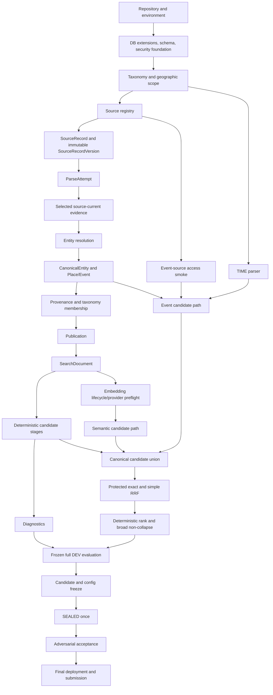

# Lemon Going-Out Search — Final Implementation Plan v1.0

**Planning status:** `FINAL_IMPLEMENTATION_PLAN_PROPOSED — PENDING FINAL ACCEPTANCE REVIEW`

**SPEC_CHANGE_REQUIRED:** None identified during correction and consolidation.

## Executive Implementation Strategy

This plan is the single proposed execution authority for the four-day build. It converts the frozen product, architecture, and technical contracts into dependency-ordered vertical slices for one strong engineer working with Codex. It replaces all prior implementation-plan wording; implementation must not reconcile this document with an earlier plan.

The execution strategy is:

1. Prove the complete real path on Day 1: permitted source → immutable evidence → selected source-current pair → canonical publication → SearchDocument → deterministic retrieval → PostgreSQL RPC → Edge → Expo.
2. Build trustworthy deterministic discovery and remove Day-3 discovery risk on Day 2: broader real inventory, conservative dedupe, provenance, taxonomy, FTS, diagnostics, EN/SV UX, the full deterministic time parser, one Event-source access/fetch smoke, and embedding provider/lifecycle preflight.
3. Use Day 3 for bounded integration and relevance: real Events, semantic retrieval, all-stage fusion, protected exact, non-collapse, and one full 60-query DEV pass against immutable judgment and dataset versions.
4. Freeze exactly one candidate on Day 4, then run SEALED once, run the fixed adversarial suite, harden, verify deployment/security/reproducibility, and submit.

The plan optimizes for shipping probability, early risk reduction, data/search truth, mechanical Codex execution, early real deployment, and safe cuts. It does not optimize for architectural elegance, adapter count, infrastructure sophistication, speculative abstraction, or UI polish.

Search/data priority is fixed:

1. data truth and legitimate inventory;
2. deterministic search quality;
3. provenance and conservative dedupe;
4. semantic and Event behavior;
5. evaluation and diagnosability;
6. usable mobile flows;
7. visual polish.

No major capability is first implemented on Day 4. Documentation, evaluation artifacts, deployment evidence, and known-issue notes accumulate from Day 1.

## Frozen Inputs

### Product authority

Requirements Baseline v1.1.

### Architecture authority

Final Architecture v1.0 — `ARCHITECTURE_APPROVED`.

### Technical authority

Final Technical Specification v1.0 — `FINAL_TECHNICAL_SPECIFICATION_FROZEN`.

### Execution authority

This Final Implementation Plan v1.0, after final acceptance review.

Implementation may not reinterpret the frozen documents. Architecture governs architectural choices; the Final Technical Specification is the sole implementation-facing contract; this plan governs order, packaging, gates, and safe schedule behavior. A genuine conflict or impossible frozen invariant must be reported as `SPEC_CHANGE_REQUIRED`, never silently changed.

## Frozen vs Tunable Decisions

| Decision Type | Meaning | Examples | Change Authority |
|---|---|---|---|
| Architecture-frozen | A system-level decision that implementation must preserve. | Postgres-only trial search datastore; canonical/source identity separation; Place/Event split; no heuristic auto-merge; protected exact; simple RRF; broad non-collapse; exact pgvector; thin Edge; no request-time scraping. | ADR and architecture review. |
| Technical-contract-frozen | An exact data, lifecycle, API, security, or evaluation contract. | SourceRecordVersion/ParseAttempt semantics; selected source-current evidence; canonical-current independence; evidence-pinned duplicate decisions and OPEN_REVIEW; Event half-open intervals; READY/FAILED/STALE; Edge→PostgREST→`api.search_v1`; fixed 60/30/20 allocation. | Explicit Technical Specification change. |
| Tunable | A versioned search/operational parameter selected using DEV and benchmark evidence. | Prefix length; trigram threshold; candidate depths; RRF `k`; `shouldEmbed`; model/revision/dimension; timeout; Event freshness; non-collapse thresholds. | Engineer selects a versioned candidate using approved DEV evidence. |
| Free implementation detail | Local organization or helper choice that cannot alter a frozen behavior. | Helper/function names; file organization; adapter HTTP library; local script layout; SQL helper/CTE shape; CLI formatting; mobile component structure. | Engineer/Codex, provided contracts and tests remain intact. |

## Implementation Principles

1. Execute vertical acceptance slices, not schema/backend/frontend waterfalls.
2. Land each risky invariant with its tests and verification command.
3. Keep every migration reproducible from an empty Supabase project.
4. Disable a source until human legal/access/persistence review is complete.
5. Capture evidence before parsing; select source-current evidence explicitly; never move canonical truth implicitly.
6. Make eligibility authoritative and apply it before retrieval or exact protection.
7. Do not tune a search failure until diagnostics identify inventory, eligibility, stage, union, or rank cause.
8. Freeze query identity early and freeze judgments plus dataset manifest before every tuning pass.
9. Never edit an inspected judgment version in place.
10. Only DEV may drive iterative tuning; SEALED and adversarial remain post-freeze acceptance evidence.
11. Prefer one bounded source/model that satisfies the contract to multiple partial integrations.
12. Manual review uses scripts, controlled SQL, and reports—never a new admin app.
13. Deploy the real Supabase + Edge + Expo path on Day 1 and expand it daily.
14. Codex cannot decide source legality, taxonomy truth, ambiguous identity, Swedish quality, or final relevance.

## Dependency Graph

`TIME-01` can proceed once reference timezone/phrases are known and does not wait for Event ingestion. Embedding lifecycle/provider preflight starts only after deterministic SearchDocument exists. Event and semantic candidate implementation may proceed in parallel on Day 3. RRF helper code may be prepared earlier, but ranking is not complete, tunable, or acceptable until all applicable deterministic, Event, and semantic candidate stages participate in the union.

## Four-Day Master Schedule

| Day | Objective | Critical path | Parallel Codex work | Manual engineer work | Evaluation state | Deployed state | Binary exit | Safe cuts only |
|---|---|---|---|---|---|---|---|---|
| Day 1 | One legitimate Place traverses the complete real path to Expo. | Bootstrap → DB tranches → current evidence → references → OSM → canonical publication → SearchDocument → known-item search → security RPC → Edge → Expo. | Evaluation scaffolding, fixtures, README, minimal mobile shell after contracts. | Rights/boundary/source review, first entity truth, migration/security review, secrets, smoke. | 110 query identities/splits/families fixed; judgments scaffolded, not necessarily complete. | Trial DB, Edge, and minimal Expo path. | Gates A and B. | CI niceties, extra entities, enrichment, visual polish. |
| Day 2 | Trustworthy deterministic discovery plus Day-3 risk preparation. | Inventory → dedupe/provenance/taxonomy → SearchDocument/FTS/union → diagnostics → EN/SV UX. | TIME-01; Event-source smoke; embedding preflight; deterministic DEV runner; docs. | Source enablement, taxonomy/duplicates, coverage, frozen subset judgments, Event/provider validation. | Each tuning subset has frozen manifest/judgment version; versions advance instead of mutating. | Deterministic multi-source discovery and bilingual category UX. | Gate C. | Additional adapters/enrichment, extra alias refinement, opening-hours depth, UI polish. |
| Day 3 | Event and semantic stages join final ranked candidate universe; full DEV selects candidate. | Bounded Event ingestion/path + model selection/vector generation/semantic path → canonical union → RRF/protected exact → non-collapse → mobile → full DEV. | Event and semantic streams may run in parallel; RRF tests/fixtures may be prepared. | Event facts, Swedish semantics, broad quality, all 60 DEV judgments frozen before pass, candidate selection. | Full 60 DEV on pinned corpus/judgments/dataset/config/clock; only explicit new versions after material inventory change. | Event + semantic + final ranking. | Gate D. | Extra Event/model experiments, optional explicit dates, advanced breaker, extra presentation. |
| Day 4 | Freeze, accept, harden, reproduce, and submit. | Critical cleanup → regression/perf → candidate freeze → SEALED once → adversarial → deployment/security/repro → docs. | Report generation and checklist updates around immutable run artifacts. | Final interpretation, security/device smoke, reviewer access, submission quality. | Frozen candidate; 30 SEALED exactly once; fixed 20 adversarial post-freeze. | Final verified candidate. | Gate E. | All noncritical enrichment, polish, new adapters, extra experiments. |

## Day 1 — Foundation + First Vertical Slice

### Day objective

By end of Day 1, at least one legitimate Jönköping Place has flowed through the real source/version/parser/current-evidence/canonical/publication/SearchDocument path and is searchable through the real Edge→Postgres contract from Expo. This is non-negotiable.

### Critical path

1. **Repository/bootstrap.** Create the Expo app, Supabase local/trial setup, shared TypeScript contracts, ingestion/evaluation/test/script layout, environment validation, and lightweight quality commands. Avoid framework abstractions.
2. **DB-01A.** Extensions, schemas, enums, geography/reference/source/ingestion/SourceRecord/version/parse-attempt foundation.
3. **DB-01B.** Canonical entities, Place, Event, provenance, aliases, duplicate review, taxonomy/membership.
4. **DB-01C.** SearchDocuments, embeddings, minimal search config, indexes/supporting types. Each tranche must pass clean reset before the next contract-sensitive task.
5. **DB-02.** Implement immutable SourceRecordVersion, ParseAttempt lifecycle, same-content parser replay, selected `(version, parseAttempt)` current evidence, failed-newer-parse preservation, active ingestion/parser-execution validation, lock/CAS behavior, and source-current/canonical-current independence.
6. **REF-01.** Seed the Active Going-Out Taxonomy, bilingual labels/aliases, Jönköping scope, versioned municipality boundary/timezone, and reviewed source-registry skeleton. Validate geometry before activation.
7. **EVAL-01.** Fix all 110 query IDs, exact text, split, family, language, `pair_group_id`, and hard/intended constraints. Create versioned corpus, manifest, and judgment schemas; final entity judgments need not all exist yet.
8. **ING-01 + SRC-01.** Use one bounded, reviewed OSM/Overpass path: fetch → capture/version → ParseAttempt → selected source-current evidence → resolve → canonical Place → supported taxonomy → municipality validation → provenance/publication → SearchDocument. Prove idempotent rerun.
9. **SEARCH-01.** Implement eligibility, accent-preserving canonical exact, qualified verified-alias exact, ordinary accentless exact, prefix, and trigram with restricted stage diagnostics.
10. **SEC-01 + EDGE-01.** Deploy Mobile → Edge → Data API/PostgREST → `api.search_v1` → private `app`. Keep backend secret only in Edge; deny no-key/publishable/direct-private paths; verify non-login owner, empty `search_path`, fully qualified SQL, and no dynamic SQL.
11. **MOB-01.** Query input, loading, Place card, empty, and recoverable error; no polish beyond usability.

### Parallel Codex work

- Prepare query-corpus schemas/allocation guards while database tranches are reviewed.
- Build source parsing fixtures and the Expo shell after public types exist.
- Grow README/setup/source-note skeletons.
- Do not parallel-edit current-evidence migrations, canonical transactions, or security grants.

### Manual engineer work

- Review OSM terms, attribution, permitted persistence, and bounded access.
- Verify boundary authority, geometry, timezone, and activation.
- Validate the first real Place and supported taxonomy membership.
- Review DB-02 invariants and SEC-01 ownership/grants.
- Configure real secrets and deployments; inspect the app bundle/repository/logs for leakage.
- Confirm evaluation query identity/design.

### Required milestones and state

- **Evaluation:** query identity/allocation frozen; manifest/judgment version scaffolding exists.
- **Deployment:** trial DB + real Edge + minimal Expo path is live before end of day.
- **Documentation:** README bootstrap, setup, initial architecture/source notes.

### Day 1 exit — Gates A and B

PASS only if all are true:

- clean DB reset/migrate works for DB-01A/B/C;
- boundary is valid/active and taxonomy seed/checksum is valid;
- bounded OSM sample reruns without duplicate versions/canonical entities;
- parser replay and selected current-evidence invariants pass;
- one real published in-scope Place exists with provenance and SearchDocument;
- canonical exact, alias qualification, prefix, and trigram retrieve correctly;
- Edge→PostgREST→RPC succeeds and unauthorized direct paths/private reads fail;
- Expo displays the deployed real result with correct states;
- no backend/provider secret is client-side, committed, or logged.

If this fails, remove optional Day-1 work and repair the gate; do not compensate by taking on Day-2 scope.

## Day 2 — Deterministic Discovery + Risk Preparation

### Day objective

By end of Day 2, real multi-source inventory supports trustworthy name, typo, category, and lexical discovery with provenance, conservative dedupe, diagnostics, and bilingual UX; the independent Event-source, time-parser, and embedding-provider risks required for Day 3 are already proven.

### Critical path

1. **SRC-02 inventory expansion.** Expand OSM only as needed. Add selected bounded Jönköping municipal layers for nature/public places, sports, culture, attractions, or activities where they materially improve coverage. Do not build a generic crawler. Use bounded Wikidata/official enrichment only to close a real identity/factual gap.
2. **DEDUP-01.** Generate DuplicateCandidates and implement append-only OPEN/OPEN_REVIEW, SAME Type A, SAME Type B, SEPARATE, UNSURE, stale-evidence re-opening, reversal, and concurrency. Use CLI/controlled SQL; no admin UI.
3. **PROV-01.** Implement critical-fact provenance, source revocation lookup, and minimal compliance redaction with `redacted_by = session_user`. Do not create generic evidence infrastructure.
4. **TAX-01.** Apply deterministic/manual mappings and generate per-active-leaf unique legitimate published count, searched sources/runs, and `COMPLETE`, `SUPPLY_CONSTRAINED`, or `NEEDS_VALIDATION`.
5. **DOC-01 + SEARCH-02.** Complete deterministic SearchDocument, weighted `simple`/SV/EN FTS, taxonomy retrieval, parent/descendant expansion, direct-leaf preference, and candidate union.
6. **DIAG-01.** Before serious tuning, answer “Why did X not reach top 5?” with existence, eligibility, exact qualification, stage presence/rank, union presence, provisional/final evidence, config, and document version. Keep diagnostics private; no dashboard.
7. **MOB-02.** Add EN/SV UI switch, localized taxonomy, category browse, correct loading/empty/error, request cancellation/stale-response protection. Query language remains independent of UI locale.

### Independent Day-3 risk preparation

#### TIME-01 — complete on Day 2

Implement a deterministic, clock-injectable Europe/Stockholm parser with IANA DST behavior and half-open intervals.

- English: tonight, this evening, tomorrow, weekday names, this Friday, this weekend, next weekend.
- Swedish: ikväll, imorgon, weekday equivalents, på fredag, i helgen, nästa helg.
- Test exact equality boundaries, DST transitions, ambiguous/unsupported inputs, and deterministic clock fixtures.
- No LLM parser.

#### SRC-03A — Event-source smoke on Day 2

Select exactly one bounded Event source and prove before Gate C:

- terms/legal/persistence/access are acceptable;
- refresh mode is declared;
- credentials/access work;
- stable occurrence external IDs exist;
- one real bounded fetch works and payload is inspected;
- schedule, status, venue/location evidence exists or has a safe bounded interpretation;
- a small upcoming sample is available.

Do not implement comprehensive Event ingestion or add a second source unless the first cannot meet the required bounded contract.

#### EMBED-01A — late Day-2 preflight

After SearchDocument exists, implement provider configuration/client, one document request, requested/returned dimension validation, query/document compatibility smoke, bounded persistence, and exact embedding lifecycle behavior:

- READY contains a compatible finite non-zero vector;
- FAILED contains no vector/generated time, is terminal, and preserves error identity;
- retry creates a new row/new `attempt_key`;
- only READY→STALE mutation is allowed;
- STALE preserves vector and original `generated_at` but is not searchable.

This smoke does not select the final model by itself; bounded multilingual relevance selection remains Day 3.

### Sparse-leaf stopping rule

Stop additional acquisition for a leaf when any one is true:

1. the reasonable permitted trial source classes have been exhausted;
2. repeated additional searches produce no legitimate incremental unique entities; or
3. authoritative/local evidence indicates actual supply is below target.

Then ingest all legitimate supply, mark `SUPPLY_CONSTRAINED`, retain source/run evidence, and move on. Never stretch or fabricate taxonomy membership to reach 5–10.

### Evaluation lifecycle

- Before any deterministic subset tuning, freeze the dataset manifest and the judgment version used.
- Once results are inspected, do not edit that judgment version.
- If inventory materially changes, create a new dataset/judgment version and rerun against it.
- A representative DEV subset is sufficient on Day 2; all 60 full DEV judgments are not required until the Day-3 pass.

### Parallel Codex work

- Run TIME-01 alongside inventory/dedupe/search work.
- Run SRC-03A legal/access-dependent fixture work and EMBED-01A only when their prerequisites are available.
- Build evaluation reports and mobile localization without changing ranking contracts.

### Manual engineer work

- Approve source rights/enablement and Event-source interpretation.
- Decide taxonomy truth and ambiguous duplicates.
- Inspect legitimate inventory and coverage evidence.
- Freeze/version deterministic DEV judgments before use.
- Verify provider credentials/dimension and Event stable-ID/source payload.

### Required milestones and state

- **Evaluation:** deterministic DEV subset runs only on frozen versions.
- **Deployment:** deterministic multi-source discovery, diagnostics-backed API behavior, and EN/SV category UX are deployed.
- **Documentation:** source inventory, commands, versioning rules, and coverage limitations recorded.

### Day 2 exit — Gate C

PASS only if all are true:

- representative real inventory supports exact/alias/prefix/typo/FTS/taxonomy discovery;
- diagnostics attribute representative misses;
- duplicate/manual resolution, stale re-open, reversal, and concurrency are safe;
- targeted provenance/revocation/redaction paths work;
- every active leaf has a reproducible truthful coverage status;
- EN/SV category/mobile behavior works;
- TIME-01 required phrase, DST, half-open, and equality tests pass;
- one Event source passes legal/access/stable-ID/real-fetch/evidence smoke;
- embedding client/lifecycle/dimension/query-document compatibility smoke passes;
- deterministic DEV evaluation uses an immutable judgment version.

Full Event ingestion and full semantic relevance selection are deliberately not required for Gate C.

## Day 3 — Event + Semantic + Final Ranking

### Day objective

By end of Day 3, bounded real Event/time search and EN/SV semantic search participate in the canonical candidate universe; protected exact, fixed RRF, deterministic rank, and broad non-collapse produce final results; the full frozen 60-query DEV set selects the Day-4 candidate configuration.

Day 3 is integration and relevance work—not provider discovery, source access discovery, or time-parser construction.

### Phase 1 — bounded Event path

Using the Day-2-proven source:

- ingest bounded upcoming real Events through SourceRecord/version/ParseAttempt/source-current evidence;
- resolve to canonical Event with linked Place or valid standalone venue/location;
- capture schedule/status/venue/location provenance;
- implement Event freshness, explicit cancellation, expiry, active horizon, and selected refresh-mode behavior;
- integrate TIME-01 half-open intervals into `event_candidates` and Event diagnostics.

Tests must cover known-end overlap, point Events, exact equality, stale/cancelled/expired Events, outage ≠ cancellation, and DELTA absence ≠ disappearance.

### Phase 2 — semantic path

Perform a very small bounded multilingual comparison only if needed. Select one provider/model/revision/dimension using DEV semantic relevance, EN/SV behavior, latency, and operational compatibility—never a broad bake-off.

Then:

- generate required document vectors under the exact SearchDocument/model contract;
- retrieve only READY compatible vectors using exact pgvector cosine scan;
- implement deterministic `shouldEmbed`, query embedding, timeout/circuit handling, response validation, and vector-NULL fallback;
- expose semantic-stage diagnostics;
- ensure eligibility/protected exact are unaffected.

### Phase 3 — fusion and final ranking

Only after applicable Event and semantic candidates work:

1. canonical candidate union with exactly-once canonical IDs;
2. preserve each stage rank/evidence;
3. fixed/simple RRF for ordinary candidates;
4. protected eligible canonical/qualified-alias exact outside ordinary score competition;
5. deterministic context/tie ordering;
6. broad-only, relevance-primary non-collapse;
7. shaped public projection.

Test subtype, chain, and Event-venue concentration; alternatives/no-alternatives; known-item and narrow taxonomy immunity; and no promotion of clearly weaker results.

### Phase 4 — mobile

Add Event cards, time-aware queries, semantic flow, factual fields, and `semanticDegraded` state. Do not redesign the app.

### Phase 5 — full 60 DEV evaluation

Before the first full pass, freeze and checksum:

- query corpus and all 60 DEV judgments;
- dataset/canonical corpus and source-run manifest;
- taxonomy and boundary;
- SearchDocument template/hash set;
- provider/model/revision/dimension;
- search config candidate;
- code commit and evaluation clock.

Those 60 judgment records cannot be edited in place once inspected. Material legitimate inventory changes require a new explicit manifest/judgment version and a complete rerun. Preserve the old result.

Run all 60 DEV and report known-item metrics, candidate Recall@20, Precision@5/NDCG@5, EN/SV breakdown, lexical-only versus hybrid, broad non-collapse assertions, latency, and failure attribution. Use a few reasoned candidate configurations, never brute-force grids. Tune only approved tunables.

### Manual engineer work

- Validate Event facts/status/venue/time and Swedish parser outputs.
- Inspect Swedish and English semantic relevance.
- Finalize/freeze all full-DEV judgments before the pass.
- Judge broad-discovery relevance and non-collapse behavior.
- Select and document one candidate configuration for Day 4.

### Required milestones and state

- **Evaluation:** full 60 DEV executes against an immutable judgment/dataset version; candidate selection is recorded.
- **Deployment:** Event + semantic + final RRF/non-collapse + mobile states deployed.
- **Documentation:** evaluation report draft, search trade-offs, measured known issues.

### Day 3 exit — Gate D

PASS only if all are true:

- bounded legitimate upcoming Events exist and Event/time retrieval is correct;
- Event and semantic candidates both participate where applicable;
- provider failure produces complete deterministic results with `semanticDegraded=true`;
- READY/FAILED/STALE and exact-compatible retrieval pass;
- final RRF sees every applicable candidate stage and exact protection passes;
- broad non-collapse passes without known-item/narrow/relevance regression;
- Event/semantic/degraded mobile flows work;
- full 60 DEV runs against frozen versions;
- selected candidate/config is documented and ready for Day-4 freeze.

## Day 4 — Acceptance + Hardening + Submission

### Day objective

By end of Day 4, the selected candidate is frozen, accepted, deployed, reproducible, secure, diagnosable, and packaged for reviewer handoff. Day 4 contains no first implementation of a major capability.

### Phase 1 — acceptance-critical cleanup

Fix only obvious missing legitimate supply, visible duplicates, mapping errors, Event correctness, stale/bad data, and `SUPPLY_CONSTRAINED` evidence. Do not start a new adapter unless a required capability is genuinely blocked.

### Phase 2 — automated regression

Run clean migrations/reset, ingestion/parser replay, source-current evidence, duplicate stale review/reversal, provenance/redaction, all deterministic stages, taxonomy, Event/time/freshness, embeddings/fallback, RRF, non-collapse, API/security, and mobile smoke.

### Phase 3 — performance

Benchmark representative queries and measure Edge, provider, DB, backend, and client separately.

- Direct/category target: p50 ≤100 ms; p95 ≤300 ms.
- Semantic target: p50 ≤750 ms; p95 ≤1.5 s.

Do not add infrastructure or prematurely optimize when evidence is acceptable; disclose misses.

### Phase 4 — candidate/config freeze

Freeze exactly one acceptance candidate and record Git commit, dataset/corpus/source runs, query corpus, DEV judgments, taxonomy, boundary, SearchDocument/template hashes, provider/model/revision/dimension, search config, and clock. No unrecorded mutation is allowed after freeze.

### Phase 5 — SEALED 30

Run the fixed 30 exactly once against the frozen candidate. Do not tune that candidate from SEALED results. A genuine correctness repair creates a new candidate/version, records the prior result as superseded, and does not silently convert SEALED into DEV.

### Phase 6 — adversarial 20

Run the fixed 20 post-freeze for state/scope, cancellation/expiry, duplicates, scarcity, language, provider degradation, and concentration/non-collapse. It is acceptance evidence, not an unlimited tuning pool.

### Phase 7 — deployment, security, and reproducibility

Verify trial Supabase, ordered migrations/seeds, source registry/ingestion, search functions/config, Edge, Expo, Event refresh/expiry, and time-bounded read-safe reviewer access. Re-run from a clean checkout where practical.

Security smoke must prove no-key denied, publishable denied, Edge succeeds, private tables denied, diagnostics/compliance restricted, `lemon_api_owner` cannot write, and secrets are absent from app/repository/logs.

### Phase 8 — submission package

Finalize README, meaningful Git history, Expo instructions, reviewer access, ingestion commands, sources, architecture/search overview, evaluation report, known issues/cuts, Another Week, and checklist from artifacts accumulated on Days 1–3.

### Manual engineer work

- Approve any final data/taxonomy/duplicate correction before freeze.
- Interpret final regression/latency/DEV evidence and authorize candidate freeze.
- Run real-device/deployed/security smoke and configure reviewer access.
- Inspect SEALED/adversarial only after freeze; document, do not mine.
- Perform final submission-quality review.

### Day 4 exit — Gate E

PASS only when the frozen Technical Specification’s Final Four-Day Definition of Done and the final checklist in this document are fully satisfied. Any failed mandatory assertion is disclosed and blocks PASS.

## Codex Execution Queue

Each package is a bounded review unit. “Files” names the expected module area; exact helper filenames remain free implementation detail. Verification commands are conceptual repository commands and may be mapped to the final package scripts without changing their assertions. Every package must preserve the frozen authorities identified in its task prompt.

### Day 1 queue

#### BOOT-01 — repository/environment/bootstrap

- **Depends on:** none.
- **Objective:** executable monorepo baseline for Expo, Supabase, shared contracts, ingestion, evaluation, scripts, and tests.
- **Frozen references:** required repository boundaries; public API types; no new infrastructure.
- **Files/modules:** root workspace config; `apps/mobile`; `supabase`; `packages/contracts`; `packages/ingestion-domain`; `packages/evaluation`; `scripts`; README/env examples.
- **Constraints:** no production feature implementation, secret values, framework layer, queue/cache/service, or client DB credential.
- **Tests/checks:** install/typecheck/lint/unit runner; Expo shell; local Supabase start/reset command exists.
- **Verify:** `pnpm install`, `pnpm typecheck`, `pnpm test`, local Expo/Supabase smoke.
- **DoD:** clean checkout can install, validate environment, run tests, and render the shell.
- **Must not change:** frozen module/trust boundaries, API shape, deployment architecture.

#### DB-01A — foundation/reference/source migrations

- **Depends on:** BOOT-01.
- **Objective:** extensions, private/public/diagnostic schemas, enums, geography, sources, ingestion runs, SourceRecords, immutable versions, and parse attempts.
- **Frozen references:** exact final schema, ownership, immutability, refresh/source identity.
- **Files/modules:** ordered `supabase/migrations`; DB constraint fixtures/tests.
- **Constraints:** capture-before-parse; parser state never stored on SourceRecordVersion; no giant cross-domain patch.
- **Tests/checks:** empty reset; constraints/indexes/FKs; version/attempt immutability; source/run idempotency.
- **Verify:** `supabase db reset`; `pnpm test:db -- db-01a`.
- **DoD:** clean database reaches the exact source/reference foundation and rejects invalid ownership/state rows.
- **Must not change:** table/enum/currentness semantics, SourceRecord identity, payload/redaction contract.

#### DB-01B — canonical/domain/taxonomy migrations

- **Depends on:** DB-01A.
- **Objective:** CanonicalEntity, Place, Event, provenance, aliases, DuplicateCandidate/decisions, taxonomy, and memberships.
- **Frozen references:** subtype integrity; no heuristic auto-merge; duplicate evidence; taxonomy hierarchy; Event lifecycle.
- **Files/modules:** next ordered migrations; DB tests.
- **Constraints:** Place/Event remain distinct subtypes; decisions append-only; memberships evidence-bearing.
- **Tests/checks:** subtype, FK/check/unique, positional duplicate evidence, taxonomy hierarchy, Event interval storage constraints.
- **Verify:** clean reset plus `pnpm test:db -- db-01b`.
- **DoD:** canonical/review/taxonomy schema is reproducible and invalid cross-subtype or decision states fail.
- **Must not change:** duplicate operations, Event status/interval semantics, canonical/source separation.

#### DB-01C — search/projection/config migrations

- **Depends on:** DB-01B.
- **Objective:** SearchDocuments, embeddings, search configs, supporting indexes/types, and minimal projection foundations.
- **Frozen references:** deterministic evidence-grounded documents; exact pgvector; READY/FAILED/STALE; versioned configs.
- **Files/modules:** final foundation migration tranche; projection/vector DB tests.
- **Constraints:** no ANN index; vectors never become canonical truth; private schemas remain private.
- **Tests/checks:** SearchDocument identity/hash constraints; embedding state constraints; config activation/versioning.
- **Verify:** clean reset plus `pnpm test:db -- db-01c`.
- **DoD:** projection/config foundation passes reset and invalid embedding states are rejected.
- **Must not change:** exact vector retrieval, state machine, deterministic document contract.

#### DB-02 — source-current evidence and parser replay

- **Depends on:** DB-01A; reviewed before ING-01.
- **Objective:** implement the exact selected `(SourceRecordVersion, successful ParseAttempt)` current-evidence contract with active run/parser-execution validation and CAS.
- **Frozen references:** source-current selection, parser replay, canonical-current independence, redaction availability.
- **Files/modules:** DB functions/triggers; ingestion-domain selection adapter; parser replay fixtures.
- **Constraints:** failed attempt cannot select; historical successful attempt is insufficient without active processing identity; current pair is both null or both present; canonical writes are separate.
- **Tests/checks:** high-risk DoD section below.
- **Verify:** `pnpm test:db -- source-current`; `pnpm test:integration -- parser-replay`.
- **DoD:** every required replay/currentness/concurrency case passes and canonical state remains unchanged by selection alone.
- **Must not change:** SourceRecordVersion identity, ParseAttempt lifecycle, active-run validation, source-current/canonical-current independence.

#### REF-01 — taxonomy and Jönköping reference seed

- **Depends on:** DB-01A/B.
- **Objective:** deterministic Active Going-Out Taxonomy, bilingual labels/aliases, scope, versioned boundary/timezone, and reviewed source skeleton.
- **Frozen references:** active taxonomy semantics; full municipality boundary; version/checksum behavior.
- **Files/modules:** seed YAML/JSON/GeoJSON; checksums; seed/validation scripts.
- **Constraints:** boundary remains inactive until geometry/source validation; no invented taxonomy nodes.
- **Tests/checks:** checksum, hierarchy, label uniqueness, geometry validity, point-in-boundary fixtures, repeat seed.
- **Verify:** `pnpm seed:reference`; `pnpm test:reference`.
- **DoD:** identical seed produces identical reference state and an authoritative active valid boundary.
- **Must not change:** taxonomy, boundary scope, timezone, source authority.

#### EVAL-01 — fixed corpus and version scaffolding

- **Depends on:** BOOT-01.
- **Objective:** encode all 110 stable query identities and allocation guards plus manifest/judgment schemas.
- **Frozen references:** exact family table, 60/30/20, semantic 16/8/6, paired-language constraints.
- **Files/modules:** `evaluation/corpus`; schemas; checksum/version tooling; fixtures.
- **Constraints:** SEALED judgments inaccessible to tuning; query/pair identity immutable except explicit new corpus version.
- **Tests/checks:** total/family/split counts; pair group same split; semantic paired/mixed minimum; schema validation.
- **Verify:** `pnpm eval:validate-corpus`.
- **DoD:** allocation cannot drift unnoticed and version/checksum artifacts are reproducible.
- **Must not change:** counts, family allocation, semantic/pair minimum, split identity.

#### ING-01 — six-stage ingestion core

- **Depends on:** DB-02, REF-01.
- **Objective:** fetch → capture/version → parse/validate → resolve → canonical/taxonomy → projection/publication orchestration.
- **Frozen references:** stage boundaries, capture-before-parse, run/retry/idempotency, no heuristic identity.
- **Files/modules:** ingestion-domain runner; adapters interface; CLI scripts; fixtures.
- **Constraints:** adapters do not write search truth directly; failures preserve last good; partial runs do not imply disappearance.
- **Tests/checks:** NEW/CHANGED/UNCHANGED; live retry versus terminal retry; parser failure/replay; rerun idempotency; stage failure preservation.
- **Verify:** `pnpm ingest:fixture`; `pnpm test:ingestion`.
- **DoD:** a fixture source reruns with deterministic counts and no duplicate evidence/canonical rows.
- **Must not change:** six stages, evidence/canonical separation, snapshot/delta semantics.

#### SRC-01 — bounded OSM adapter

- **Depends on:** ING-01 plus human legal/access gate.
- **Objective:** fetch and parse a bounded representative Jönköping Place sample.
- **Frozen references:** source registry/policy; stable `(source, external_key)`; no request-time fetching.
- **Files/modules:** `source-adapters/osm`; raw/normalized fixtures; command/config.
- **Constraints:** bounded query, attribution/persistence rules, no taxonomy stretching, no generic crawler.
- **Tests/checks:** real bounded fetch; fixture parse; invalid rows; rerun/hash reuse; in/out-boundary samples.
- **Verify:** `pnpm ingest:osm --scope <id> --bounded`; rerun and compare counts.
- **DoD:** at least one legitimate Place reaches selected evidence and canonical processing reproducibly.
- **Must not change:** source rights assumptions without review, identity keys, capture/version semantics.

#### SEARCH-01 — eligibility and known-item retrieval

- **Depends on:** DB-01C, REF-01, one published Place.
- **Objective:** eligibility, canonical exact, verified alias qualification, accentless ordinary exact, prefix, and trigram.
- **Frozen references:** eligibility first; exact protection; same-name/non-collision behavior; `norm-v1`.
- **Files/modules:** private SQL stage helpers/CTEs; indexes; DB fixtures; diagnostic evidence fields.
- **Constraints:** exact protection only after eligibility; accentless/prefix are never protected; no semantic/RRF dependency.
- **Tests/checks:** high-risk DoD below.
- **Verify:** `pnpm test:db -- search-known-item`; representative `api` fixture query after SEC-01.
- **DoD:** legitimate canonical/qualified aliases retrieve correctly and ineligible/colliding/ordinary matches do not gain protection.
- **Must not change:** eligibility, alias qualification, protection rules, normalization.

#### SEC-01 — DB roles, grants, and search RPC boundary

- **Depends on:** DB-01A/C; SEARCH-01 for final smoke.
- **Objective:** expose only the shaped `api.search_v1` RPC to Edge’s backend credential.
- **Frozen references:** Edge→PostgREST path; `api`-only exposed schema; non-login owner; grant matrix.
- **Files/modules:** security migrations; `api.search_v1`; auth-smoke script/tests.
- **Constraints:** SECURITY DEFINER, empty `search_path`, fully qualified SQL, no dynamic SQL; owner has SELECT/internal EXECUTE only and no writes/raw payload.
- **Tests/checks:** high-risk DoD below.
- **Verify:** `pnpm test:security`; deployed no-key/publishable/secret/private-table smoke.
- **DoD:** only Edge secret path succeeds; all forbidden paths fail without internal leakage.
- **Must not change:** public contract, exposed schema, roles/grants, one-RPC trust boundary.

#### EDGE-01 — thin Edge and real RPC

- **Depends on:** SEC-01, SEARCH-01.
- **Objective:** validate/cap request, assign request ID, deterministic context, call exactly one `api.search_v1`, shape safe V1 response.
- **Frozen references:** SearchRequest/Response V1, public endpoint behavior, Edge-held secret, one DB call.
- **Files/modules:** `supabase/functions/search`; shared contracts/validation; API tests.
- **Constraints:** no ranking/canonical writes/raw payload; do not forward client Authorization; mobile gets Edge URL only.
- **Tests/checks:** malformed/empty/limits/filter validation, CORS/methods, safe errors, one-RPC assertion.
- **Verify:** `pnpm test:api`; deployed curl/mobile smoke.
- **DoD:** deployed Edge returns the real published Place with safe metadata and correct unauthorized behavior.
- **Must not change:** API V1, one-RPC path, backend secret boundary.

#### MOB-01 — minimal real search UI

- **Depends on:** EDGE-01.
- **Objective:** usable query-to-real-Place path.
- **Frozen references:** mobile uses public response only and no DB credential.
- **Files/modules:** search screen/client; PlaceCard; loading/empty/error states.
- **Constraints:** no direct Supabase Data API; no polish project; prevent obvious stale response.
- **Tests/checks:** component/client state tests; deployed/device smoke.
- **Verify:** `pnpm --filter mobile test`; Expo deployed query.
- **DoD:** reviewer can search and render the first real Place through Edge.
- **Must not change:** public API/trust boundary or factual projection.

### Day 2 queue

#### SRC-02 — bounded municipal supplement

- **Depends on:** ING-01; human source/layer gate.
- **Objective:** add only high-value legitimate public/activity inventory.
- **Frozen references:** same source/version/parser pipeline and truthful taxonomy.
- **Files/modules:** selected municipal layer adapters/fixtures/config/docs.
- **Constraints:** no generic crawler; each layer has explicit source/legal/refresh metadata; stop when incremental benefit ends.
- **Tests/checks:** bounded fetch/parse/rerun; stable key; scope; mapping evidence.
- **Verify:** layer-specific ingest command plus rerun/coverage diff.
- **DoD:** selected layers add legitimate unique entities and remain reproducible.
- **Must not change:** source pipeline, taxonomy truth, scope.

#### DEDUP-01 — DuplicateCandidate/manual decisions

- **Depends on:** DB-02, ING-01.
- **Objective:** conservative candidate generation and exact append-only manual resolution/reversal lifecycle.
- **Frozen references:** no heuristic auto-merge; positional evidence; OPEN_REVIEW; Type A/B; locking.
- **Files/modules:** DB functions; candidate generator; review CLI; fixtures.
- **Constraints:** ambiguity remains unresolved; decisions never overwritten; stale evidence cannot jump directly to a final decision.
- **Tests/checks:** high-risk DoD below.
- **Verify:** `pnpm test:db -- duplicate-review`; scripted review/reversal smoke.
- **DoD:** Type A/B, separate/unsure, staleness, re-open, reversal, and concurrency pass with history intact.
- **Must not change:** decision schema/sequence/evidence, auto-merge prohibition, canonical repair semantics.

#### PROV-01 — targeted provenance and compliance

- **Depends on:** DB-01B, ING-01.
- **Objective:** provenance for critical facts, revocation lookup, and bounded redaction.
- **Frozen references:** targeted fact set; provenance currentness; compliance exception and actor identity.
- **Files/modules:** canonical transaction support; redaction function; revocation/report CLI; tests.
- **Constraints:** ordinary source versions immutable; redaction only through compliance owner/function; logs never include removed content.
- **Tests/checks:** history/current singular fact, lookup, ordinary update denial, redaction purge/reselection/withhold, idempotent operation, `session_user` audit.
- **Verify:** `pnpm test:db -- provenance-redaction`.
- **DoD:** critical visible facts trace to exact evidence and revoked content/derivatives are safely removed while identity/history remain.
- **Must not change:** provenance scope/currentness, redaction contract, authenticated actor semantics.

#### TAX-01 — mappings and coverage

- **Depends on:** SRC-01, SRC-02, REF-01.
- **Objective:** evidence-bearing deterministic/manual taxonomy membership and per-leaf coverage report.
- **Frozen references:** active hierarchy; multi-label; truthful scarcity; mapping methods.
- **Files/modules:** mapping rules/versions; manual command; coverage query/report.
- **Constraints:** no inferred stretch to hit targets; unique canonical counts only.
- **Tests/checks:** allowed evidence method, direct/ancestor behavior, duplicate-safe counts, source/run evidence, status logic.
- **Verify:** `pnpm coverage:generate`; schema/checksum validation and human sample review.
- **DoD:** every active leaf has count, evidence, searched runs, and truthful status.
- **Must not change:** taxonomy, target meaning, scarcity behavior.

#### DOC-01 — deterministic SearchDocument

- **Depends on:** TAX-01; canonical publication.
- **Objective:** reproducible evidence-grounded lexical/embedding projection.
- **Frozen references:** field weights/content; `simple`+SV+EN vectors; active document/hash; no fabrication.
- **Files/modules:** projection builder/SQL; template/version; rebuild CLI; tests.
- **Constraints:** deterministic inputs/order; descriptions never outrank names by construction; no model-generated truth.
- **Tests/checks:** same input same hash/content, fact/taxonomy change invalidation, idempotent rebuild, FTS weights.
- **Verify:** `pnpm search-documents:rebuild`; rerun hash diff must be empty.
- **DoD:** all published eligible entities have the correct active deterministic document.
- **Must not change:** projection evidence, weighting contract, offline-only embeddings.

#### SEARCH-02 — FTS, taxonomy, and candidate union

- **Depends on:** DOC-01, SEARCH-01.
- **Objective:** weighted multilingual lexical and hierarchical taxonomy candidates in a diagnosable union.
- **Frozen references:** stage decomposition, direct-leaf preference, parent descendants, same eligible universe.
- **Files/modules:** private SQL stages/union; tests/index verification.
- **Constraints:** no final RRF claim; retain stage rank/evidence; hard filters remain authoritative.
- **Tests/checks:** EN/SV/mixed lexical, names over descriptions, parent/leaf, narrow filters, stage dedupe/ranks.
- **Verify:** `pnpm test:db -- search-discovery`; DEV subset smoke.
- **DoD:** representative category/lexical queries retrieve legitimate eligible inventory with traceable stage ranks.
- **Must not change:** eligibility, stage semantics, taxonomy expansion.

#### DIAG-01 — restricted search diagnostics

- **Depends on:** SEARCH-02.
- **Objective:** attribute misses across existence, eligibility, exact qualification, stages, union, rank, config, and document version.
- **Frozen references:** diagnostic privacy/access and required evidence.
- **Files/modules:** `diagnostic` SQL/functions; CLI/report; permission tests.
- **Constraints:** no public/Edge trace, raw source content, dashboard, or ranking mutation.
- **Tests/checks:** known fixtures for each failure class; unauthorized access denied.
- **Verify:** `pnpm diagnose-search --query-id <dev-id>`; `pnpm test:security -- diagnostics`.
- **DoD:** representative “why not top 5?” cases are unambiguously attributable.
- **Must not change:** public response, diagnostic trust boundary.

#### MOB-02 — bilingual/category UX

- **Depends on:** SEARCH-02, EDGE-01.
- **Objective:** EN/SV interface, localized taxonomy browse, robust deterministic discovery states.
- **Frozen references:** UI locale independent of query language; public factual response.
- **Files/modules:** localization resources; category browse; request state handling.
- **Constraints:** no query-language lock to UI; no client ranking.
- **Tests/checks:** EN/SV labels, category request, empty/error, cancellation/stale response.
- **Verify:** mobile tests plus real-device/deployed bilingual smoke.
- **DoD:** both locales support name/category flows and correct states.
- **Must not change:** API semantics or taxonomy truth.

#### TIME-01 — deterministic EN/SV time parser

- **Depends on:** BOOT-01, timezone/reference constants; independent of Event adapter.
- **Objective:** required phrase-to-Europe/Stockholm half-open intervals with injected clock.
- **Frozen references:** phrase set, IANA/DST, Event half-open/point semantics.
- **Files/modules:** `packages/time-parser`; phrase tables; unit fixtures.
- **Constraints:** no LLM, locale guess that changes hard filters, or unversioned clock.
- **Tests/checks:** every EN/SV phrase, weekday rollover, this/next weekend, DST, equality, unsupported ambiguity.
- **Verify:** `pnpm test -- time-parser`.
- **DoD:** deterministic fixtures yield exact UTC interval boundaries under injected clocks.
- **Must not change:** required phrases, timezone, half-open semantics.

#### SRC-03A — Event-source access/fetch/stable-ID smoke

- **Depends on:** source registry, human legal/access gate.
- **Objective:** remove Day-3 source-discovery risk without full integration.
- **Frozen references:** permitted source, stable occurrence identity, refresh semantics, required Event evidence.
- **Files/modules:** bounded probe/fixture/config/source notes; not production adapter completion.
- **Constraints:** exactly one chosen source unless it fails; no canonical/publication integration claim.
- **Tests/checks:** credentials/access, bounded real fetch, stable ID across repeat, payload field inspection, refresh declaration.
- **Verify:** `pnpm source:smoke:event`; saved redacted/allowed fixture inspection.
- **DoD:** a legal, accessible source supplies a small legitimate upcoming sample with usable identity/schedule/status/venue evidence.
- **Must not change:** Event canonical/time/status contracts or source rights interpretation.

#### EMBED-01A — lifecycle/provider/dimension preflight

- **Depends on:** DOC-01.
- **Objective:** prove provider connectivity, vector compatibility, persistence, and exact embedding state machine.
- **Frozen references:** READY/FAILED/STALE; model/document contract; exact pgvector; terminal FAILED.
- **Files/modules:** embedding client/runner; DB functions; provider fixture; state tests.
- **Constraints:** no final model-quality claim; no ANN; never overwrite FAILED for retry.
- **Tests/checks:** high-risk embedding DoD below plus one real bounded document/query smoke.
- **Verify:** `pnpm embeddings:preflight`; `pnpm test:embeddings`.
- **DoD:** valid compatible vector persists/searches; invalid/failure/stale/retry cases obey the exact state contract.
- **Must not change:** state transitions, vector compatibility, offline document generation.

#### EVAL-02 — versioned deterministic DEV evaluation

- **Depends on:** EVAL-01, DIAG-01.
- **Objective:** run a representative deterministic DEV subset with metrics and failure attribution.
- **Frozen references:** DEV-only tuning and manifest/judgment immutability.
- **Files/modules:** runner/report schemas; subset manifest; metric tests.
- **Constraints:** freeze judgment+dataset before run; no SEALED read; new versions after material inventory change.
- **Tests/checks:** metric fixtures, split access guard, checksum mismatch failure.
- **Verify:** `pnpm eval:dev --manifest <version> --subset deterministic`.
- **DoD:** reproducible report ties every result to immutable versions/config/clock and diagnostics.
- **Must not change:** corpus allocation, judgment lifecycle, approved metrics.

### Day 3 queue

#### SRC-03B — bounded Event ingestion/canonicalization

- **Depends on:** SRC-03A PASS, ING-01, human Event-fact review.
- **Objective:** production-bounded adapter for real upcoming occurrences through the frozen evidence/canonical pipeline.
- **Frozen references:** stable occurrence key; source/version/attempt; refresh/disappearance; Event/venue/provenance.
- **Files/modules:** Event adapter; mapping/canonicalization; fixtures; refresh command.
- **Constraints:** no second source unless first is incapable; outage/absence never implies cancellation; no recurrence engine.
- **Tests/checks:** fetch/capture/reparse/rerun; schedule update; explicit cancellation; venue link/standalone; refresh-mode absence.
- **Verify:** bounded ingest twice; inspect counts/evidence/canonical rows.
- **DoD:** small legitimate upcoming inventory is reproducibly canonicalized with exact evidence.
- **Must not change:** Event identity, cancellation, refresh, source-current/canonical-current semantics.

#### EVENT-01 — Event eligibility/freshness/time candidates

- **Depends on:** SRC-03B, TIME-01, SEARCH-02.
- **Objective:** correct Event visibility and candidate ranking inputs.
- **Frozen references:** scheduled status; half-open/point overlap; expiry; horizon; freshness; source outage semantics.
- **Files/modules:** Event eligibility/expiry/freshness SQL; `event_candidates`; diagnostics; scheduled command.
- **Constraints:** filters before candidate protection/fusion; stale/cancelled/expired absent; daily refresh/expiry uses existing scheduler/CI only.
- **Tests/checks:** high-risk DoD below.
- **Verify:** `pnpm test:db -- events`; `pnpm events:expire --clock <fixture>`; diagnostic queries.
- **DoD:** real Event/time queries and every boundary/freshness/refresh-mode assertion pass.
- **Must not change:** half-open/point predicates, explicit cancellation, horizon/freshness contract.

#### EMBED-01B — selected model vector generation

- **Depends on:** EMBED-01A, bounded human model selection.
- **Objective:** generate compatible vectors for the active SearchDocument corpus using one selected multilingual contract.
- **Frozen references:** active provider/model/revision/dimension/hash compatibility; READY-only retrieval.
- **Files/modules:** model config candidate; batch runner/checkpoint/report.
- **Constraints:** small reasoned comparison only; no multi-provider abstraction or ANN; failures remain visible and retry as new attempts.
- **Tests/checks:** dimension/non-finite/zero validation; document hash/model compatibility; partial run rerun; old READY→STALE on contract change.
- **Verify:** `pnpm embeddings:generate --config <candidate>`; coverage/state report.
- **DoD:** required active documents have valid READY vectors or explicit preserved failures, with no incompatible retrieval.
- **Must not change:** lifecycle, compatibility, exact scan architecture.

#### SEM-01 — semantic query path and fail-open

- **Depends on:** EMBED-01B, EDGE-01, SEARCH-02.
- **Objective:** deterministic `shouldEmbed`, compatible query vector, exact semantic candidates, and vector-NULL degradation.
- **Frozen references:** additive semantic path; same eligible universe; Edge validation; deterministic fallback.
- **Files/modules:** Edge embedding/heuristic/circuit code; `semantic_candidates`; telemetry/diagnostics; tests.
- **Constraints:** no LLM router/rewriter/reranker/date parser; failures cannot fail deterministic search or bypass hard filters.
- **Tests/checks:** high-risk DoD below.
- **Verify:** `pnpm test:semantic`; injected timeout/rate/5xx/invalid/dimension/open-circuit deployed smoke.
- **DoD:** compatible query improves applicable DEV retrieval; every provider failure yields deterministic 200 and degradation evidence.
- **Must not change:** additive semantics, exact pgvector, READY-only compatibility, fail-open response.

#### RANK-01 — canonical union, protected exact, and fixed RRF

- **Depends on:** SEARCH-02, EVENT-01, SEM-01 for final integration.
- **Objective:** combine all applicable stages into one deterministic exactly-once canonical rank.
- **Frozen references:** simple RRF formula; stage ranks; protected exact; eligibility; stable ties.
- **Files/modules:** union/fusion/rank SQL; config candidate; contribution diagnostics; tests.
- **Constraints:** helper code may pre-exist, but final DoD waits for Event+semantic; no learned/weighted fusion or reranker.
- **Tests/checks:** high-risk DoD below.
- **Verify:** `pnpm test:db -- rank`; stage-contribution report; repeat determinism.
- **DoD:** all applicable candidate families contribute correctly, protected exact remains first-class, and IDs occur exactly once.
- **Must not change:** RRF formula, exact protection, eligibility, public projection.

#### NONCOLLAPSE-01 — broad-only relevance-primary non-collapse

- **Depends on:** RANK-01.
- **Objective:** reduce subtype/chain/Event-venue concentration only for broad queries with comparable alternatives.
- **Frozen references:** broad applicability; relevance primacy; exactly-once; known-item/narrow immunity.
- **Files/modules:** final rank adjustment/diagnostics; versioned vocabulary/config; fixtures.
- **Constraints:** no quotas that promote clearly weaker results; no effect on known-item or narrow taxonomy.
- **Tests/checks:** high-risk DoD below.
- **Verify:** `pnpm test:db -- noncollapse`; broad DEV assertion report.
- **DoD:** concentration assertions pass where alternatives exist, without relevance or protected-exact regression.
- **Must not change:** broad-only scope, relevance guard, exact-once.

#### MOB-03 — Event, semantic, and degraded UX

- **Depends on:** EVENT-01, SEM-01, RANK-01.
- **Objective:** show factual Event results/time queries and semantic degradation safely.
- **Frozen references:** public response; Event factual projection; degraded flag.
- **Files/modules:** EventCard; time/semantic state handling; mobile tests.
- **Constraints:** no client reranking or provider call; no fabricated explanation.
- **Tests/checks:** Event card/status/time, semantic query, degraded result, loading/empty/error/stale response.
- **Verify:** mobile test plus deployed/device smoke.
- **DoD:** all required search flows are visible and usable in EN/SV.
- **Must not change:** API/trust boundary or factual semantics.

#### EVAL-03 — frozen-version full 60 DEV evaluation/tuning

- **Depends on:** EVAL-02, EVENT-01, SEM-01, RANK-01, NONCOLLAPSE-01, MOB-03 smoke.
- **Objective:** evaluate a small number of reasoned candidates and select one for freeze.
- **Frozen references:** all 60 DEV; approved metrics/gates; immutable judgments/manifests; no SEALED.
- **Files/modules:** pinned manifests/judgments; candidate configs; machine-readable results; report draft.
- **Constraints:** freeze all judgments before inspection; material inventory changes create vN+1; no brute-force grid; no SEALED/adversarial tuning.
- **Tests/checks:** high-risk evaluation DoD below.
- **Verify:** `pnpm eval:dev --all --manifest <v> --judgments <v> --config <candidate>`.
- **DoD:** full reproducible per-family/locale/stage report exists and one candidate is selected with evidence.
- **Must not change:** evaluation allocation, frozen judgment lifecycle, metrics, frozen search invariants.

### Day 4 queue

#### COVERAGE-01 — final coverage cleanup support

- **Depends on:** TAX-01, SRC-03B.
- **Objective:** correct only acceptance-critical inventory/mapping/duplicate/Event issues and regenerate coverage.
- **Frozen references:** truthful scarcity, legitimate supply, evidence-bearing mapping.
- **Files/modules:** final coverage manifest/report; narrowly scoped data corrections.
- **Constraints:** no new generic adapter or fabricated/stretch classification; corrections precede candidate freeze and create a new dataset version.
- **Tests/checks:** coverage schema/checksum, uniqueness, source/run evidence, manual diff.
- **Verify:** `pnpm coverage:generate --final`; manifest diff review.
- **DoD:** all active leaves have truthful final status and visible data errors are resolved/disclosed.
- **Must not change:** taxonomy/coverage semantics.

#### QA-01 — full regression/security/search/mobile smoke

- **Depends on:** all runtime packages, COVERAGE-01.
- **Objective:** execute the complete frozen automated suite before candidate freeze.
- **Frozen references:** all Technical Specification mandatory tests and DoD.
- **Files/modules:** CI/test orchestration; deployment verifier; failure report.
- **Constraints:** no weakening/skipping mandatory assertions; failures block freeze unless explicitly corrected and rerun.
- **Tests/checks:** migration, ingestion, parser, dedupe, provenance, search, Event, embeddings, API, security, mobile.
- **Verify:** `pnpm test:all`; `pnpm verify:deployment`.
- **DoD:** zero unresolved mandatory regression and complete evidence artifact.
- **Must not change:** tests/gates/contracts to make the build pass.

#### PERF-01 — latency benchmark

- **Depends on:** QA-01 candidate runtime.
- **Objective:** measure representative direct/category/semantic latency by layer.
- **Frozen references:** latency targets and measurement dimensions.
- **Files/modules:** benchmark script/query set; raw samples; percentile report.
- **Constraints:** no new cache/service/queue; do not hide cold/error samples; preserve functional config while measuring.
- **Tests/checks:** repeatable warm/cold representative samples and component timing fields.
- **Verify:** `pnpm benchmark:search --manifest <v> --config <candidate>`.
- **DoD:** p50/p95 evidence for Edge/provider/DB/backend/client and target comparison exists.
- **Must not change:** architecture or acceptance reporting.

#### EVAL-04 — freeze, SEALED, adversarial, and report

- **Depends on:** EVAL-03, QA-01, PERF-01.
- **Objective:** freeze one complete candidate, run 30 SEALED once, then fixed 20 adversarial, and publish results.
- **Frozen references:** version manifest; 60/30/20; no held-out tuning; accepted metrics.
- **Files/modules:** immutable freeze manifest; SEALED/adversarial outputs; final evaluation report.
- **Constraints:** no post-freeze in-place changes; correctness repair creates a new candidate and records supersession; adversarial is not open tuning.
- **Tests/checks:** high-risk DoD below.
- **Verify:** `pnpm eval:freeze`; `pnpm eval:sealed --once`; `pnpm eval:adversarial`.
- **DoD:** one traceable frozen candidate has complete DEV/SEALED/adversarial/latency evidence with deviations disclosed.
- **Must not change:** held-out lifecycle, allocation, candidate identity after freeze.

#### DEPLOY-01 — final deployment and reviewer access

- **Depends on:** QA-01; final frozen config from EVAL-04.
- **Objective:** verify/release the exact frozen candidate and read-safe reviewer path.
- **Frozen references:** ordered deployment; Edge security; no privileged client/reviewer secrets; Event refresh/expiry.
- **Files/modules:** deployment config/scripts; access checklist; smoke report.
- **Constraints:** deploy exact commit/config/dataset; reviewer role time-bounded/read-safe; no broad write access.
- **Tests/checks:** clean checkout/reset/seed/ingest where practical; real Edge/Expo/security smoke; scheduled commands.
- **Verify:** `pnpm verify:deployment --manifest <freeze>` plus manual device/access checks.
- **DoD:** reviewer can run/use/inspect safely and deployment matches the freeze manifest.
- **Must not change:** security boundary, frozen candidate, reproducibility.

#### DOCS-01 — final submission package

- **Depends on:** all artifacts; developed incrementally from Day 1.
- **Objective:** complete reviewer-ready documentation and checklist.
- **Frozen references:** required deliverables and disclosure obligations.
- **Files/modules:** README; `docs/trial-review/{sources,architecture-search-overview,evaluation-report,known-issues-and-cuts,submission-checklist}`; Another Week.
- **Constraints:** no invented metrics/claims or new architecture concepts; link exact commands/artifacts/versions.
- **Tests/checks:** link/command/checklist validation and human read-through from clean checkout.
- **Verify:** `pnpm docs:check` or equivalent plus manual checklist.
- **DoD:** every required artifact is present, consistent, reproducible, and candid.
- **Must not change:** frozen architecture/spec interpretation or reported results.

## High-Risk Definitions of Done

### DB-02

PASS requires all of the following:

- parser v1 fails and parser v2 succeeds over the same content H without duplicating SourceRecordVersion;
- successful unresolved H+A1 may be selected while `canonical_entity_id` remains null;
- failed H2+A2 preserves prior H1+A1 current evidence;
- successful same-H A2 may replace A1 through lock/expected-prior/CAS and does not mutate canonical truth;
- selected attempt is SUCCEEDED, belongs to selected version/record, is available/not redacted, and belongs to the active ingestion/parser execution being committed;
- arbitrary historical successful attempt selection is rejected;
- both current columns are null or both present;
- stale concurrent writer is rejected;
- canonical processing rechecks the selected pair and rejects stale input;
- selecting current evidence never implicitly changes canonical facts, memberships, projection, embeddings, or publication.

### DEDUP-01

PASS requires candidate creation, positional ownership validation for two version/attempt pairs, append-only linear history, and:

- SAME Type A links an unresolved record to an existing entity with no loser entity;
- SAME Type B merges canonical entities with recorded bounded inverse detail;
- SEPARATE and UNSURE do not create entity linkage;
- reversal executes the recorded inverse before the new OPEN state;
- new version or different successful attempt makes the finalized evidence stale;
- stale evidence cannot transition directly to SAME/SEPARATE/UNSURE;
- a current OPEN/OPEN_REVIEW pinning both current evidence pairs must first be appended/confirmed;
- if evidence changes again while OPEN, it must be re-opened/refreshed;
- locks occur in deterministic order and final current evidence/decision is rechecked before mutation;
- concurrent decisions cannot both finalize; no heuristic cross-source merge exists.

### SEARCH-01

PASS requires:

- every retriever intersects the authoritative eligibility predicate first;
- eligible accent-preserving canonical exact is protected;
- same-name eligible canonical entities coexist deterministically;
- verified alias is protected only when it satisfies the frozen scope-local/non-collision qualification;
- colliding alias loses protection;
- accentless exact, prefix, and trigram remain ordinary evidence;
- closed/merged/withheld/out-of-scope/radius-excluded or invalid Event candidates never surface or gain protection;
- short-prefix/trigram guards prevent pathological noise;
- stage/match/rank/qualification evidence is available only through restricted diagnostics.

### EVENT-01

PASS requires:

- required EN/SV phrases map via injected Europe/Stockholm clock to half-open intervals;
- known-end Event overlaps iff `starts_at < query_end AND ends_at > query_start`;
- point Event membership follows the frozen point predicate and equality tests;
- `ends_at = now` known-end Event and past point Event are expired/withheld;
- only eligible scheduled, fresh, in-horizon, in-scope Events participate;
- explicit cancellation with provenance removes the Event;
- source outage/5xx/partial run never means cancellation;
- DELTA_ONLY absence never means disappearance; only the approved snapshot rules can establish absence;
- schedule updates preserve evidence/version history;
- linked venue and standalone location behavior are factual and diagnosable;
- expiry command and search predicate agree even if the command is late.

### EMBED-01A/B

PASS requires:

- READY has active document hash, exact provider/model/revision/dimension, finite non-zero vector, and generated time;
- FAILED has null vector/generated time, attempted contract/time, required error identity, and is immutable/terminal;
- FAILED→READY and FAILED→STALE are rejected;
- retry inserts a new row with a new `attempt_key` and preserves the failure;
- only READY→STALE mutation succeeds;
- STALE retains the original vector and `generated_at`, records a stale reason, and is never searchable;
- direct STALE insert and incompatible dimension/model/document retrieval fail;
- only one compatible READY contract is active as specified;
- document generation is offline and exact pgvector uses no ANN index.

### SEM-01

PASS requires:

- deterministic `shouldEmbed` skips disabled/circuit-open, empty, time-only, recognized structured-only, and conservative wholly known-item queries as frozen/tuned; deterministic retrieval always remains;
- eligible broad/occasion/mixed/uncertain queries invoke the selected compatible model as configured;
- query template includes only normalized text and recognized deterministic taxonomy/time context;
- exact cosine scan uses READY embeddings matching active SearchDocument hash and model contract and re-applies eligibility;
- semantic evidence is additive and cannot bypass filters/protected exact;
- timeout, rate limit, 5xx, invalid/non-finite/zero/wrong-dimension/model mismatch, and open circuit all send vector NULL;
- every such failure returns complete deterministic results with `semanticDegraded=true`, bounded reason telemetry, safe API body, and no internal leakage;
- no LLM routing, rewriting, reranking, date parsing, or taxonomy truth is introduced.

### RANK-01

PASS requires:

- deterministic, lexical/FTS/taxonomy, Event, and semantic candidates participate where applicable;
- union key is canonical entity ID and each final ID appears exactly once;
- every participating stage retains its rank/evidence;
- ordinary score is the frozen simple RRF formula with versioned `k`, not learned/weighted fusion;
- eligibility is already enforced and cannot be reversed;
- protected eligible canonical/qualified-alias exact is handled outside ordinary RRF competition;
- accentless/prefix/semantic evidence cannot acquire protected status;
- deterministic context and UUID tie behavior yield identical repeated order;
- diagnostics expose contributions without changing public response.

### NONCOLLAPSE-01

PASS requires:

- rule activates only for versioned broad EN/SV applicability;
- known-item, protected exact, and narrow taxonomy requests are unchanged;
- grouping covers approved subtype/taxonomy level, explicit chain, and Event venue dimensions;
- caps apply only when comparably relevant eligible alternatives exist;
- clearly weaker candidates are never promoted to satisfy diversity;
- no alternative means original relevance order remains;
- final IDs remain exactly once and deterministic;
- concentration and relevance assertions pass together.

### SEC-01

PASS requires:

- mobile contains only Edge URL and no publishable/service/secret Data API credential;
- Edge stores `SUPABASE_URL` and backend secret privately, does not forward client Authorization, and invokes exactly `.schema('api').rpc('search_v1', ...)` once;
- Data API exposes `api` only; `api` contains no table/view and only the shaped search routine;
- `api.search_v1` is SECURITY DEFINER, owned by non-login `lemon_api_owner`, has empty `search_path`, fully qualified objects, validated parameters, and no dynamic SQL;
- public/anon/authenticated/no-key/publishable EXECUTE and all direct private-table paths fail;
- only service role has API usage/execute; Edge secret path succeeds;
- `lemon_api_owner` has minimal search SELECT/internal EXECUTE, no writes/raw payload/secrets;
- diagnostics and compliance remain separately restricted;
- responses/logs expose no secret, vector, raw payload, SQL, or internal error.

### EVAL-03 and EVAL-04

`EVAL-03` PASS requires all 60 DEV query/judgment records and the dataset manifest frozen before inspection, checksums verified, all approved metrics/family/locale/stage/failure reports generated, lexical-only versus hybrid reported, a small reasoned candidate set only, no SEALED access, and one evidence-backed candidate selected.

`EVAL-04` PASS requires a freeze manifest pinning commit, corpus, all data/source runs, judgments, taxonomy, boundary, SearchDocument hashes/template, model contract, config, and clock; exactly one SEALED run for that candidate; fixed adversarial run only after freeze; immutable raw/results/report artifacts; and explicit supersession rather than hidden mutation if a correctness repair forces a new candidate.

## Manual Engineer Workstream

| When | Human-owned decisions/actions | Deliverable/blocker removed |
|---|---|---|
| Day 1 morning | Confirm OSM rights, attribution, persistence, rate/access posture; verify municipality boundary source/geometry; approve taxonomy seed identity. | Sources/boundary can be enabled. |
| Day 1 throughout | Review DB-01A/B/C and DB-02 contract-sensitive migrations; validate first Place/provenance/mapping; create secrets and deploy. | Gates A/B are trustworthy, not fixture-only. |
| Day 1 end | Confirm 110 query identities/families/pairs and perform deployed security/mobile smoke. | Corpus identity and first vertical slice are real. |
| Day 2 morning | Select/approve municipal layers; resolve ambiguous duplicates; approve mapping rules and sparse-leaf evidence. | Inventory/dedupe/taxonomy do not block search. |
| Day 2 afternoon | Freeze deterministic DEV subset judgments; inspect diagnostics; approve one Event source and payload/stable IDs; validate provider/dimension smoke. | Gate C and Day-3 prerequisites. |
| Day 3 morning | Validate Event schedules/status/venues and Swedish time results; conduct bounded multilingual model comparison. | Event/model factual selection. |
| Day 3 afternoon | Freeze all 60 DEV judgments before full pass; inspect EN/SV semantics, broad relevance, and failures; select one candidate. | Gate D and Day-4 candidate. |
| Day 4 pre-freeze | Approve only acceptance-critical data corrections, interpret QA/performance, and authorize freeze. | Stable acceptance candidate. |
| Day 4 post-freeze | Observe SEALED/adversarial without tuning; execute real-device/security/reviewer smoke; review disclosures/docs/checklist. | Gate E and submission quality. |

Codex may propose candidates, produce reports, and execute mechanical checks. It must never silently decide source rights, taxonomy truth, ambiguous SAME/SEPARATE, relevance grades, Swedish adequacy, Event facts, secrets/access, or final acceptance interpretation.

## Database Migration Sequence

| Tranche | Contents | Review/verification boundary |
|---|---|---|
| DB-01A | Extensions; `app`/`api`/`diagnostic`; enums; geographic scope/boundary; sources; ingestion runs; SourceRecords; immutable versions; parse attempts. | Clean reset; source/version/attempt ownership and immutability tests before DB-02. |
| DB-01B | Canonical entities; Place/Event subtypes; provenance; aliases; duplicate candidates/append-only decisions; taxonomy/membership. | Clean reset; subtype, decision, positional evidence, hierarchy/Event constraints before canonical work. |
| DB-01C | SearchDocuments; embeddings; search configs; supporting indexes/types. | Clean reset; document/config and exact READY/FAILED/STALE constraints before projection/provider work. |
| DB-02 | Selection/processing functions, locks/CAS, triggers, parser replay/current-evidence invariants. | Dedicated high-risk suite and engineer review before ingestion. |
| Subsequent bounded migrations | Security/RPC, provenance/redaction, dedupe operations, stage functions, Event/search helpers. | Each lands with targeted tests; no unrelated cross-domain migration bundle. |

Every tranche is forward-only, ordered, reproducible from empty trial/local projects, and independently reviewable. Exact grouping may adjust only for real FK/dependency order; it may not become a single DB-01 mega-patch or alter schema semantics.

## Source Acquisition Plan

| Source | Day/contribution | Legal/access gate | Adapter complexity | Expected taxonomy benefit | Stopping condition |
|---|---|---|---|---|---|
| OSM/Overpass | Day 1 first vertical slice; Day 2 broad Place inventory. | Review ODbL/attribution, permitted stored envelope, endpoint policy/rate limits, source URL and registry metadata before enablement. | Low–medium, bounded Overpass query and explicit tag mapping. | Broad food/drink, retail-like going-out venues, parks/attractions, some sports/culture. | Stop expansion when broad inventory and representative deterministic retrieval are proven or additional fetches add no legitimate unique entities. |
| Selected Jönköping municipal data | Day 2 bounded public/nature/sports/culture/activities supplement. | Review each chosen layer’s licence, access, persistence, refresh unit/mode, stable key, and municipality authority. | Medium per selected layer; prohibited as a generic portal crawler. | Sparse/high-value public places, nature, sports, culture, attractions, activities. | Stop after chosen high-value layers are exhausted or incremental unique legitimate supply becomes negligible. |
| Optional Wikidata/official enrichment | Day 2 only if a concrete identity/alias/official-fact gap remains. | Respect endpoint/site access and persistence; official/manual facts require human verification. | Low when bounded by known QID/place; high if generalized, so generalization is prohibited. | Identity, alternate/official names, official URL, a small number of critical facts—not bulk coverage. | Cut entirely when inventory/search already has sufficient truth; stop after the named gaps are closed. |
| One bounded Event source | Day 2 access/stable-ID/evidence smoke; Day 3 real upcoming Event ingestion. | Human approval of terms/persistence, credentials, occurrence ID, refresh semantics, schedule/status/venue evidence. | Medium but deliberately bounded to one source and active horizon. | Representative culture/sports/activity/other upcoming Event search and lifecycle. | One source is enough once bounded real lifecycle/time behavior is proven; add no second source unless the first cannot meet the minimum frozen behavior. |

All sources use the same Source → SourceRecord → immutable SourceRecordVersion → ParseAttempt → selected source-current pair → resolution/canonical transaction path. No adapter becomes a search-time dependency. A source remains disabled when rights/access/persistence are unclear.

## Taxonomy Coverage Plan

For every active leaf:

1. Start with already-ingested unique published canonical entities; never count source duplicates.
2. Apply only explicit source facts, reviewed deterministic mapping rules, or manual evidence-bearing membership.
3. Search OSM, then only the selected relevant municipal layers, then bounded enrichment if a specific high-value gap remains.
4. Track source/run searched, candidate rows inspected, accepted unique entities, mapping evidence, and unresolved/invalid exclusions.
5. Target 5–10 legitimate entities only where that supply exists.
6. Apply the sparse-leaf stopping rule as soon as permitted reasonable sources are exhausted, repeated searches yield no incremental legitimate unique supply, or authoritative evidence indicates lower supply.
7. Mark:
   - `COMPLETE` when the chosen trial source strategy has captured the legitimate target/supply with validation;
   - `SUPPLY_CONSTRAINED` when real supply is below target after documented search;
   - `NEEDS_VALIDATION` when candidates/evidence exist but truth is not yet approved.
8. Surface all legitimate supply for scarce leaves; never copy a nearby class, over-broaden a parent, or invent a venue to meet a number.
9. Regenerate the coverage artifact after material inventory/mapping changes and pin it in the dataset manifest.

Execution is coverage-driven, not leaf-by-leaf perfectionism. High-impact missing leaves and visible misclassification outrank enrichment of already adequate leaves.

## Search Implementation Sequence

This is the sole conceptual order and is consistent with every day/task:

1. **Eligibility** — publication/scope/boundary/radius/type/state/taxonomy/Event status/time/horizon/freshness.
2. **Canonical/alias exact** — accent-preserving canonical and only qualified verified alias protection.
3. **Accentless/prefix/trigram** — ordinary evidence with indexed/length/threshold controls.
4. **SearchDocument/FTS** — deterministic weighted `simple`, Swedish, and English lexical projection.
5. **Taxonomy candidates** — bilingual recognition, direct leaf, parent descendants, narrow filters.
6. **Event candidates** — factual Event/venue/category plus deterministic time eligibility.
7. **Semantic candidates** — compatible READY exact-cosine vector, same eligible universe, additive only.
8. **Canonical union** — one canonical ID, all stage ranks/evidence retained.
9. **Protected exact + fixed RRF** — protection outside ordinary simple RRF competition.
10. **Deterministic final rank** — context and fixed ties.
11. **Broad non-collapse** — broad-only, comparable-relevance, exactly-once adjustment.
12. **Public projection** — frozen shaped SearchResponse, no internal trace.

Restricted diagnostics accompany each stage from the moment that stage exists. RRF helper code can land before steps 6–7, but fusion/final-rank DoD cannot pass until all applicable stages are integrated.

## Event Implementation Sequence

1. Foundation Event schema/subtype/constraints in DB-01B.
2. Event-source legal/access/stable-ID/payload smoke on Day 2 (`SRC-03A`).
3. Complete TIME-01 independently on Day 2.
4. Convert the proven source into the bounded Day-3 adapter (`SRC-03B`).
5. Capture/version/parse/select evidence; resolve linked Place or valid standalone venue/location.
6. Canonicalize schedule/status with targeted provenance; configure declared refresh mode.
7. Implement horizon/freshness, cancellation, expiry, and search-time safety predicate.
8. Build Event SearchDocument/venue context and `event_candidates`.
9. Add restricted Event diagnostics and factual mobile cards.
10. Validate equality/DST/point/known-end/stale/cancelled/expired/outage/DELTA cases.
11. Run Event DEV families and deploy.
12. Use only existing scheduler/CI/platform scheduling for at-least-daily refresh/expiry; add no queue/service.

## Semantic Implementation Sequence

1. Deterministic SearchDocument and active content hashes exist.
2. Day-2 provider/client/document request and query/document dimension compatibility smoke.
3. Enforce full READY/FAILED/STALE lifecycle and exact vector persistence/retry behavior.
4. Day 3: compare only a very small viable multilingual set if necessary; human selects one contract using DEV EN/SV relevance, latency, and compatibility.
5. Generate document vectors offline; report READY/FAILED coverage; stale incompatible prior READY vectors.
6. Implement versioned deterministic `shouldEmbed` and fixed query-template input.
7. Validate provider output and send compatible vector or NULL to the one RPC.
8. Exact cosine semantic candidates over compatible READY active documents, intersected with eligibility.
9. Implement timeout/circuit/invalid/dimension/model/rate/5xx fail-open and bounded telemetry.
10. Compare lexical-only versus hybrid on frozen DEV; finalize only within full ranking/non-collapse integration.

No LLM router, query rewriter, reranker, date parser, truth generator, ANN index, or request-time document embedding is permitted.

## Mobile Integration Sequence

| Slice | Capability | Acceptance focus |
|---|---|---|
| Day 1 | Query, Edge client, loading, Place cards, empty, recoverable error. | Real deployed result, no DB credential, stale response avoided. |
| Day 2 | EN/SV switch, localized taxonomy, category browse, robust cancellation/error states. | Query language independent of UI locale; factual server results. |
| Day 3 | Event cards, time-aware queries, semantic/degraded state, optional distance when supplied. | No client ranking/provider call; factual Event fields; deterministic fallback remains usable. |
| Day 4 | Real-device/usability fixes, final Expo run/build path, reviewer instructions. | Exact frozen deployment, no major redesign or polish detour. |

## Evaluation Versioning & Tuning Plan

### Query corpus contract

From Day 1, each query has fixed/versioned ID, exact text, family, language, split, pair group, request filters, evaluation clock/hard constraints, and intended assertions. Query identity does not drift to fit the current inventory. Translation/close-paraphrase pair members remain in the same split.

### Fixed allocation

| Query family | DEV | SEALED | Adversarial | Required coverage |
|---|---:|---:|---:|---|
| Canonical exact / same-name | 5 | 3 | 1 | Accent-preserving, duplicate names, out-of-scope exact. |
| Verified/colliding aliases | 3 | 2 | 1 | Qualified and deliberately unqualified. |
| Prefix | 4 | 2 | 1 | Unique and short ambiguous. |
| Typo/transposition/accent/spacing | 5 | 2 | 2 | One-edit and short-token protection. |
| Taxonomy parent/leaf | 7 | 3 | 2 | EN/SV labels, direct leaf, descendant expansion. |
| Broad discovery | 4 | 2 | 2 | General Places/Activities and mixed eligible inventory. |
| Semantic occasion/language | 16 | 8 | 6 | DEV 8 EN/SV pairs; SEALED 4 pairs; adversarial six mixed/multi-constraint. |
| Event/time | 6 | 3 | 2 | EN/SV phrases, venue, horizon/freshness. |
| Geo/scope/radius | 3 | 2 | 1 | Municipality edge, radius, missing point. |
| Scarcity/duplicate/state | 3 | 2 | 1 | Supply constrained, duplicate ambiguity, cancelled/expired. |
| Broad concentration | 4 | 1 | 1 | Subtype, chain, Event venue; relevance guard. |
| **Total** | **60** | **30** | **20** | **110 fixed.** |

The semantic subset is exactly 16 DEV / 8 SEALED / 6 adversarial. It includes at least 12 paired EN/SV semantic intents (24 queries) and at least 6 mixed/adversarial semantic queries. These are part of—not additional to—the 110.

### Judgment versions and dataset manifests

Before any tuning pass:

1. freeze the exact judgment version;
2. freeze the dataset manifest;
3. verify checksums and split access;
4. record code/config/model/clock.

After results are inspected, never mutate that judgment version. A material legitimate inventory change requires an explicit new dataset and judgment version; the previous input and result remain preserved. A rationale correction discovered before a pass can create a new version. Silent in-place edits are prohibited.

The dataset manifest pins canonical dataset and SourceRecord run IDs, active boundary/taxonomy checksum, normalization, SearchDocument template/hash set, provider/model/revision/dimension, search config, clock, corpus/judgment checksums, and code commit.

Judgment grades remain `0=not relevant`, `1=marginal`, `2=relevant`, and `3=highly relevant`. Any entity violating an explicit hard constraint—scope, radius, entity type, taxonomy filter, Event status/time/freshness, or another request filter—has grade 0 regardless of textual similarity. Each failure receives one primary attribution: inventory, normalization/alias, dedupe, taxonomy, deterministic interpretation, candidate retrieval, semantic representation, fusion/rank, or eligibility/Event state.

### Approved metrics and gates

| Concern | Required metric/report and gate |
|---|---|
| Known item | Hit@1, Hit@3, MRR; canonical exact Hit@1 ≥98%; alias top-3 ≥95%. |
| Prefix/typo | Prefix top-3 ≥95%; unambiguous prefix Hit@1 ≥90%; reasonable typo top-3 ≥90%. |
| Candidate | Recall@20 by family/stage and zero-result rate. |
| Visible rank/category | Precision@5 and NDCG@5; category NDCG@5 ≥0.80; supply-relative category Recall@5 ≥0.85. |
| Semantic | Lexical-only versus hybrid NDCG@5/Recall@5; target ≥0.75/≥0.80 where supply exists; EN/SV reported separately. |
| Bilingual | Paired-query overlap@5 diagnostic target generally ≥60%, plus independent relevance metrics. |
| Broad | Precision@5/NDCG@5 first; per-query subtype/chain/venue assertions; no weaker-than-cohort promotion. |

No aggregate may hide a known-item, Event-state, geography, eligibility, protected-exact, or non-collapse failure.

### DEV

- Only DEV may be iteratively tuned against.
- Day 2 may use a frozen deterministic subset.
- Before Day-3 full tuning, all 60 judgments are frozen.
- Run approved known-item, Recall@20, Precision@5/NDCG@5, semantic lexical-vs-hybrid, bilingual, broad concentration/relevance, zero-result, failure-attribution, and latency reports.
- Prefer 2–3 reasoned candidate configurations; do not grid-search.
- A model/config change creates a new candidate and result artifact.

### SEALED

- Judgments remain inaccessible until the Day-4 freeze manifest exists.
- Run the 30 exactly once for that frozen candidate.
- Never tune the same candidate from the results.
- A genuine correctness blocker requires an explicit new candidate; prior run is retained/superseded and SEALED is not silently treated as DEV.

### Adversarial

- Run the fixed 20 after candidate freeze.
- Use it for acceptance of hard state/scope/degradation/concentration behavior.
- It is not a general-purpose open tuning pool.

## Testing Execution Plan

### Day 1

- Clean migration/reset for every DB tranche.
- SourceRecordVersion/ParseAttempt immutability and parser replay/current evidence.
- Seed checksum/boundary geometry/scope.
- OSM capture/rerun/publication/SearchDocument.
- Eligibility, canonical/alias exact, accentless, prefix, trigram.
- RPC owner/grants/no-key/publishable/private denial and Edge success.
- Minimal mobile real-data smoke.

### Day 2

- Municipal adapter rerun and mapping evidence.
- Duplicate Type A/B, separate/unsure, stale decisions, OPEN_REVIEW, reversal, concurrency.
- Provenance/revocation/redaction/session actor.
- Taxonomy parent/leaf and coverage status.
- SearchDocument hash/weight/idempotency; EN/SV/mixed FTS; taxonomy union.
- Diagnostic access and failure attribution.
- All time-parser phrases/DST/equality.
- Event-source and provider/dimension/lifecycle preflights.
- Frozen-version deterministic DEV subset.

### Day 3

- Event occurrence/rerun/update/cancellation/venue and refresh semantics.
- Event known-end/point equality, expiry, freshness, outage, DELTA absence.
- Embedding READY/FAILED/STALE/retry/compatibility.
- Semantic shouldEmbed/output/failure/circuit/vector-NULL fallback.
- RRF contribution, protected exact, canonical exactly-once, deterministic ties.
- Broad subtype/chain/Event-venue non-collapse with relevance guard and immunity tests.
- Event/semantic/degraded mobile flows.
- Full frozen 60 DEV.

### Day 4

- Complete regression from clean reset/checkout where practical.
- Public API validation, safety, and one-RPC assertion.
- Deployed security matrix and secret scan.
- Mobile real-device EN/SV/name/category/semantic/Event/state smoke.
- Layered latency benchmark.
- Freeze integrity; SEALED once; fixed adversarial; artifact/checksum/report verification.

The representative performance mix remains exact 20%, prefix/typo 15%, category 20%, broad 10%, semantic occasion 15%, Event/time 10%, geo 5%, and empty structured browse 5%, across EN/SV and warm/cold samples at trial scale. Report failures and component percentiles rather than claiming targets before measurement.

Tests land with their behavior and cannot be deferred or weakened to pass a gate.

## Deployment & Security Plan

### Deployment schedule

- **Day 1:** trial Supabase DB, migrations/seeds, real `api.search_v1`, Edge, and minimal Expo path deployed.
- **Day 2:** multi-source deterministic discovery, taxonomy/FTS, diagnostics-backed behavior, and bilingual category UX deployed.
- **Day 3:** bounded Event/time, semantic/fail-open, final RRF/non-collapse, and corresponding mobile states deployed.
- **Day 4:** exact frozen candidate verified/released; reviewer access and reproducibility proven.

No core deployment waits until Day 4. Smoke the deployed path after every contract-sensitive change.

### Trust boundary checklist

- Mobile calls only the public Edge URL; no Supabase Data API key or backend/provider secret.
- Edge validates/caps V1 input, generates/propagates request ID, recognizes deterministic taxonomy/time, decides `shouldEmbed`, validates vector, calls one RPC with vector or NULL, emits bounded telemetry, and shapes V1 response.
- Edge backend client never forwards caller Authorization.
- Data API exposes only `api`; `app` and `diagnostic` are not exposed.
- `api` has no tables/views; public/anon/authenticated grants are revoked.
- Only service role has API usage/execute.
- `api.search_v1` uses non-login `lemon_api_owner`, SECURITY DEFINER, empty `search_path`, qualified SQL, parameter validation, no dynamic SQL, no writes/raw payload.
- `lemon_reviewer` is bounded/manual-review safe; `lemon_compliance` only executes redaction; diagnostics remain restricted.
- Secrets never enter Git, Expo, response bodies, fixtures, docs, or logs.

### Reproducibility order

1. environment validation;
2. extensions/migrations;
3. reference seeds and boundary activation;
4. source registry;
5. ingestion and parser replay commands;
6. canonical/projection rebuild;
7. document embeddings;
8. search config/functions/RPC;
9. Edge secrets/deployment;
10. Expo run/build;
11. Event refresh/expiry command;
12. reviewer verification.

## Diagnostics Plan

Diagnostics are restricted engineering evidence, not a public feature.

### Search diagnostics

For a request/query/entity, expose:

- request/config/corpus/document/model versions and evaluation clock;
- entity/source existence and current evidence IDs;
- publication/eligibility decision with bounded reason codes;
- exact/alias qualification and collision status;
- each candidate stage presence, rank, raw evidence, and cap cutoff;
- canonical union presence and all RRF contributions;
- protected-exact status, deterministic tie evidence;
- broad applicability, grouping, comparable-relevance decision, and adjustment;
- final rank/projection or exact failure stage;
- semantic invocation/degradation reason without vector or provider secret.

### Ingestion/data diagnostics

Expose source/run/refresh status and counts, capture hash/version, parser attempt/version/outcome, selected pair, resolution state, duplicate decision current/stale evidence, canonical provenance, projection hash, embedding state, and coverage status. Never expose prohibited raw payload, removed content, user query PII beyond approved bounded logging, secrets, or unrestricted compliance data.

### Operational form

Provide SQL/helper functions plus CLI/report output. No dashboard/admin app. A representative “why not top 5?” case must be answerable before tuning.

## Tunable Selection Plan

All selected values live in a versioned `search_configs` candidate and evaluation manifest. Change one coherent hypothesis at a time, evaluate on frozen DEV, stop once the relevant quality gate is met without material latency/other-family regression, and retain the prior candidate for rollback. Approved eligibility, exact protection, alias qualification, simple RRF formula, semantic fallback, and relevance-primary non-collapse are never tunable.

| Tunable | Initial value/range | DEV/benchmark evidence | Stopping rule | Rollback/default |
|---|---|---|---|---|
| Prefix minimum length | 2–3 | Prefix Hit@1/top-3, ambiguous noise, DB p95. | Choose the shortest length meeting prefix gate without visible short-query noise or p95 regression; at most a few reasoned values. | 3 if 2 is noisy; prior config. |
| Trigram minimum length | 3 | Typo Recall@20/top-3, short-token false positives, DB p95. | Keep 3 unless a specific frozen DEV family proves a safe change. | 3. |
| Trigram threshold | 0.25–0.45 | Typo recall, Precision@5/NDCG@5, false-positive diagnostics, DB p95. | Stop at first threshold meeting typo goals without category/name degradation; no fine grid. | Prior candidate; conservative 0.35 starting candidate. |
| Candidate caps | Exact 20; other stages 20–50; semantic 30 | Recall@20 by stage/family and DB/total p95. | Stop increasing when Recall@20 plateaus or latency materially worsens; reduce only with zero relevant-candidate loss. | Exact 20, semantic 30, other 30 baseline. |
| RRF `k` | 60 initial; very small bounded comparison | NDCG@5, candidate contributions, known-item and broad assertions. | Keep 60 unless one alternate materially improves DEV without regression; never alter formula/weights. | 60. |
| `shouldEmbed` | Invoke for broad/occasion/mixed/uncertain NL; skip disabled/circuit, empty, time-only, recognized structured-only, conservative wholly known-item | Lexical-vs-hybrid per family/language, invocation rate, cost, provider/total p95, false skip/call diagnostics. | Stop when applicable semantic queries meet quality target and avoid waste on deterministic cases without recall regression. | Frozen deterministic heuristic above; semantic disabled still preserves deterministic search. |
| Model/revision/dimension | One compatible multilingual contract; tiny viable comparison | EN/SV hybrid NDCG/Recall, pair diagnostics, valid dimension, p95, failure rate. | Select first operationally compatible model meeting bounded quality/latency evidence; no broad bake-off. | Day-2 proven compatible model; deterministic-only fail-open if provider unavailable per request. |
| Embedding timeout | 500–900 ms; initial 700 ms | Provider latency distribution, semantic p95, timeout rate, fallback correctness. | Choose smallest value preserving acceptable hybrid benefit while meeting overall semantic target. | 700 ms; vector NULL on timeout. |
| Circuit breaker | 3 consecutive failures / 30 seconds initially | Failure injection, recovery, deterministic availability, false-open rate. | Keep default unless bounded tests show availability harm; advanced breaker behavior is cuttable. | 3/30 s per Edge instance. |
| Event horizon | 30 days initial | Approved product policy, bounded inventory, Event DEV, DB p95. | Keep 30 unless frozen DEV/real supply proves a narrower safe bound; cannot remove required Event behavior. | 30 days. |
| Event freshness | Source-specific hours based on declared cadence | Refresh cadence, outage simulation, stale/cancellation tests, factual inspection. | Choose the strictest window consistent with normal source publication/refresh and no false-fresh stale data. | Conservative source-specific documented window; stale Events withheld. |
| Radius cap | 50 km maximum initially | Municipality geometry, request validity, geo DEV, DB p95. | Retain unless a smaller cap fully supports trial UX; never exceed frozen safety bound without spec authority. | 50 km. |
| Broad vocabulary | Versioned EN/SV broad terms | Broad/known-item/narrow DEV classification and result quality. | Stop once required broad queries activate and no known-item/narrow false activation occurs. | Minimal explicit EN/SV vocabulary. |
| Comparable relevance | RRF ratio 0.80–0.95 | Broad NDCG, no-weaker-promotion assertions, concentration. | Select first threshold reducing concentration while all relevance guards pass. | Conservative 0.90 or prior candidate; disable adjustment per-query when no comparable alternatives. |
| Concentration cap | 2–3 per group in top 5 | Subtype/chain/venue concentration and relevance assertions. | Use least intervention that passes broad concentration without NDCG/known-item regression. | 3 per group. |
| Hierarchy grouping level | Subtype / leaf-parent | Taxonomy broad corpus and concentration diagnostics. | Pick one interpretable level that handles tested concentration without treating distinct relevant leaves as equivalent. | Subtype/leaf-parent frozen candidate value. |
| Chain repetition | 1–2 in top 5 | Explicit-chain broad queries, relevance guard. | Apply smallest restriction that passes only when comparable non-chain alternatives exist. | 2. |
| Event-venue repetition | 1–2 in top 5 | Event broad queries, venue concentration, relevance guard. | Apply smallest restriction that passes only when comparable other venues exist. | 2. |
| Tie behavior | Direct taxonomy/context, then stable UUID | Repeat-run identical ordering and narrow-context tests. | No tuning once deterministic/frozen behavior passes. | Direct context then UUID. |

## Risk Register

| Rank | Risk | Probability | Impact | Earliest detection | Mitigation | Frozen-safe fallback |
|---:|---|---|---|---|---|---|
| 1 | Four-day scope overload | High | Critical | Day 1 Gate A/B timing and Day-2 noon burn-down. | Vertical gates, small DB/source packages, Day-2 risk preflights, manual work calendar, strict cuts. | Cut optional adapters/enrichment/diagnostic presentation/model experiments/UI polish; never cut required behavior. |
| 2 | Legitimate inventory versus large taxonomy | High | High | Day-1 OSM sample and Day-2 coverage report. | Coverage-driven acquisition, municipal high-value layers, unique canonical counts, sparse-leaf rule. | Ingest all legitimate supply and mark `SUPPLY_CONSTRAINED`; no stretching. |
| 3 | Source/legal access | Medium–High | Critical | Before enabling each source; Event smoke Day 2. | Human rights/access/persistence gate, bounded requests, documented registry/refresh mode. | Disable unclear source; use another permitted bounded source only if required capability is blocked. |
| 4 | Human validation workload | High | High | Day-1 first 20–30 rows and Day-2 duplicate/coverage queue size. | Prioritize visible/high-risk entities, scripts/reports, conservative unresolved status, stopping rule. | Leave ambiguous duplicate unresolved/`NEEDS_VALIDATION`; disclose, while preserving legitimate minimum system behavior. |
| 5 | Event source quality/access | Medium–High | Critical | SRC-03A on Day 2, not Day 3. | Choose one source using stable-ID/schedule/status/venue criteria; save bounded fixtures; declare refresh mode. | Switch once to another permitted bounded source before Gate C; escalate if no legitimate minimum exists. |
| 6 | EN/SV semantic quality | Medium | High | Day-2 compatibility smoke; tiny Day-3 model comparison. | One multilingual model, paired frozen DEV, human Swedish review, deterministic lexical fallback. | Keep semantic functional with best bounded compatible model and disclose weak queries; provider failure returns deterministic results. |
| 7 | Parser/data quality | Medium | Critical | DB-02 and first source replay Day 1. | Capture-before-parse, immutable H, versioned parsers, active execution/CAS, diagnostics, last-good preservation. | Replay same H with corrected parser; keep prior selected/canonical truth on failure. |
| 8 | Duplicate load/incorrect merge | Medium | High | Day-2 candidate generation/manual sample. | No heuristic auto-merge; evidence-pinned OPEN_REVIEW; Type A/B; reversal/locks. | Leave unresolved; search may show separate canonical entities rather than corrupt identity. |
| 9 | Search relevance | Medium | High | Day-2 deterministic frozen subset and diagnostics. | Deterministic stages first, failure attribution, reasoned configs, full 60 DEV, protected exact. | Revert versioned config; preserve exact/deterministic and truthful results; disclose weak DEV families. |
| 10 | Supabase/security/deployment | Medium | Critical | Day-1 real no-key/publishable/Edge smoke. | Deploy early, explicit role/grant tests, non-login owner, secret scan, daily deployed smoke. | Stop affected stream and escalate if frozen path is impossible; do not expose DB/client key as workaround. |
| 11 | Latency | Medium | High | Per-stage timing Day 1/2; provider preflight; Day-3 hybrid. | Candidate caps/indexes, exact trial-scale vector scan, timeout/circuit, component timings. | Reduce tunable caps within Recall gates, skip semantic by approved heuristic, vector NULL on provider slowness; no new cache/service. |
| 12 | UI over-polish | High | Medium | Any core task slipping while design work grows. | Fixed mobile slices and binary states; cosmetic backlog. | Cut all nonessential polish, animation, bespoke design, and extra screens. |

## Schedule-Slip Rules

### Authoritative safe cut order

Cut in this order, stopping as soon as the gate is recoverable:

1. additional source adapters;
2. optional Wikidata/official enrichment;
3. extra Event adapters;
4. opening-hours sophistication;
5. optional phone/contact enrichment;
6. optional taxonomy alias refinements beyond required EN/SV truth;
7. optional explicit-date parsing beyond required phrases;
8. bounded Levenshtein extras;
9. additional model experiments;
10. advanced circuit-breaker behavior beyond the minimal safe breaker;
11. UI polish/animation/extra screens;
12. extra diagnostic presentation beyond the required restricted evidence.

### Never cut

- SourceRecord/version/ParseAttempt/current-evidence semantics and parser replay;
- source-current/canonical-current separation;
- legitimate real inventory, active taxonomy, and municipality boundary;
- critical provenance/compliance behavior;
- conservative evidence-pinned dedupe/reversal;
- deterministic known-item/lexical/taxonomy search;
- functional semantic retrieval plus complete fail-open;
- fixed simple RRF and protected exact;
- relevance-primary broad non-collapse;
- one bounded legitimate real Event source, deterministic required time behavior, and Event lifecycle;
- EN/SV UI/query support;
- exact evaluation allocation/version lifecycle/DEV/SEALED/adversarial;
- Edge/PostgREST security boundary;
- Day-1-through-Day-4 deployment and reproducibility;
- required submission artifacts and candid disclosures.

No optional cut may weaken a gate, fabricate coverage, or move a required capability to “Another Week.”

## Submission Artifact Timeline

| Day | Artifact growth |
|---|---|
| Day 1 | README bootstrap; repository/setup/environment commands; architecture/security path sketch; OSM/boundary/source notes; evaluation corpus/version scaffold; first deployment smoke. |
| Day 2 | Source/layer/legal/refresh documentation; ingestion/reparse/coverage commands; duplicate/manual-review workflow; coverage limitations and sparse-leaf evidence; evaluation versioning procedure; Event/provider smoke notes. |
| Day 3 | Evaluation report draft with pinned full-DEV inputs/results; search/fusion/non-collapse trade-offs; model/Event decisions; measured known issues; deployed full-flow smoke. |
| Day 4 | Final metrics and immutable manifests; SEALED/adversarial/latency results; known issues and intentional cuts; Another Week; reviewer access/runbook; final checklist and meaningful Git-history review. |

Documentation is updated with each task; Day 4 edits and cross-links accumulated evidence rather than authoring a new narrative from memory.

## Implementation Gates

### Gate A — Foundation

PASS only if:

- DB-01A/B/C reset cleanly and exact schema/constraints/extensions exist;
- Active taxonomy/reference seed and valid versioned municipality boundary are active;
- DB-02 replay/current evidence and source-current/canonical-current tests pass;
- source registry/legal-review controls exist;
- role/default-revoke/API-owner security foundation passes;
- EVAL-01 fixed allocation/pair/version guards pass.

### Gate B — First vertical slice

PASS only if:

- one reviewed real OSM observation is captured/versioned/parsed/current-selected;
- it resolves to a legitimate in-scope published Place with provenance/taxonomy and deterministic SearchDocument;
- rerun is idempotent;
- eligibility/exact/qualified alias/prefix/trigram retrieve correctly;
- real Edge→PostgREST→`api.search_v1` returns it;
- no-key/publishable/private paths fail;
- deployed Expo renders it with loading/empty/error;
- secrets are absent client-side/repository/logs.

### Gate C — Deterministic discovery + risk preparation

PASS only if:

- representative multi-source inventory, conservative dedupe, provenance, taxonomy, and truthful coverage work;
- weighted FTS/taxonomy/candidate union and restricted diagnostics work;
- EN/SV category mobile works;
- deterministic subset evaluation used frozen judgment+dataset versions;
- TIME-01 required EN/SV/DST/half-open suite passes;
- one Event source passes rights/access/refresh/stable-ID/real-fetch/evidence smoke;
- embedding provider/client/dimension/query-document/lifecycle preflight passes.

### Gate D — Event + semantic + final rank

PASS only if:

- bounded real Events and factual Event/time eligibility/candidates work;
- compatible READY vectors and semantic candidates work;
- every provider failure degrades to complete deterministic response;
- canonical union, protected exact, fixed RRF, deterministic ties, and exactly-once IDs pass across all applicable stages;
- broad non-collapse passes relevance/known-item/narrow assertions;
- Event/semantic/degraded mobile flows are deployed;
- full 60 DEV runs against frozen versions and one candidate is selected.

### Gate E — Acceptance

PASS only if:

- acceptance-critical data cleanup is versioned and complete;
- full mandatory regression/security/mobile suite passes;
- layered latency evidence is recorded;
- one candidate is fully frozen;
- fixed 30 SEALED runs once and fixed 20 adversarial runs post-freeze with immutable artifacts;
- final deployed system exactly matches freeze and is reproducible;
- reviewer access is safe/usable;
- all submission artifacts/checklists and disclosures are complete;
- the Final Four-Day Definition of Done below is fully checked.

## Stop Conditions

### Stop and escalate as `SPEC_CHANGE_REQUIRED`

- a frozen DB invariant cannot be represented without changing its semantics;
- source-current active ingestion/parser-execution identity cannot be preserved under the frozen schema/contract;
- Edge→Data API/PostgREST→SECURITY DEFINER security path cannot be implemented as frozen;
- frozen documents contradict each other;
- required Event half-open/freshness/refresh rules conflict with another frozen MUST;
- duplicate stale-reopen/Type A/B/reversal behavior cannot be implemented without semantic change;
- the vector provider requires incompatible vector spaces or cannot satisfy the embedding compatibility contract.

### Stop affected source/workstream for human resolution

- source rights, access controls, persistence, or attribution are unclear;
- required Event source cannot provide legitimate stable identity plus minimum schedule/status/venue behavior;
- taxonomy truth or canonical fact conflict affects publication;
- duplicate evidence is insufficient for a manual final decision;
- compliance revocation requires content removal.

Do not bypass controls, guess legal meaning, or expose a broader credential/path.

### Not a stop condition

- legitimate leaf supply is below five;
- one tunable threshold/candidate config fails;
- one DEV semantic query is weak;
- a duplicate remains unresolved;
- OSM lacks a category;
- bounded Event coverage is not comprehensive;
- a provider request fails and deterministic fallback works.

Use `SUPPLY_CONSTRAINED`, new config/version, unresolved review, bounded source strategy, or deterministic fail-open as already frozen.

## Final Four-Day Definition of Done

### Data

- [ ] Permitted, legitimate real Jönköping Place and upcoming Event inventory exists.
- [ ] Every enabled source has documented rights/access/persistence/attribution/refresh semantics.
- [ ] Ingestion is rerunnable and NEW/CHANGED/UNCHANGED/retry/refresh behavior is correct.
- [ ] Immutable SourceRecordVersion, rerunnable ParseAttempt, and selected source-current pair tests pass.
- [ ] Failed/new parser/current selection preserves last-good canonical truth; canonical mutation rechecks evidence.
- [ ] Critical visible facts and memberships have exact provenance; revocation/redaction works.
- [ ] DuplicateCandidate decisions are conservative, append-only, evidence-pinned, reopen stale evidence, support Type A/B and reversal; no heuristic auto-merge exists.
- [ ] Place/Event subtype, publication, municipality, Event status/expiry/freshness, and source disappearance semantics pass.
- [ ] Every active taxonomy leaf has truthful unique count/status/evidence; scarce leaves use `SUPPLY_CONSTRAINED`, never fabrication.

### Search

- [ ] Authoritative eligibility precedes all retrieval/protection.
- [ ] Canonical exact and qualified verified aliases are protected correctly; same names/collisions/accentless cases pass.
- [ ] Prefix, typo/trigram, weighted FTS, EN/SV/mixed lexical, and taxonomy parent/leaf retrieval work.
- [ ] Required EN/SV deterministic time phrases and real Event/time candidates work with half-open/freshness rules.
- [ ] Compatible READY exact-pgvector semantic candidates work in EN/SV.
- [ ] Provider timeout/rate/5xx/invalid/dimension/model/circuit failures return complete deterministic results with degraded flag.
- [ ] Canonical union, fixed/simple RRF, deterministic ties, protected exact, and exactly-once final IDs pass.
- [ ] Broad-only non-collapse handles subtype/chain/Event-venue concentration without promoting weaker results or changing known-item/narrow queries.
- [ ] Restricted diagnostics explain representative inventory/eligibility/stage/union/rank failures and version context.

### Mobile

- [ ] Expo app is deployed/runnable from documented instructions.
- [ ] EN/SV switch and localized taxonomy work independently of query language.
- [ ] Name, category, natural-language semantic, and Event/time flows work against deployed Edge.
- [ ] Place/Event factual cards and loading/empty/recoverable-error/degraded/stale-response states are correct.
- [ ] Mobile has no privileged/Data API/provider secret and performs no client ranking/provider call.

### Evaluation

- [ ] Exact 60 DEV / 30 SEALED / 20 adversarial and full family allocation are preserved.
- [ ] Semantic 16/8/6, at least 12 EN/SV pairs (24 queries), and at least 6 mixed/adversarial semantic queries are preserved; pairs share split.
- [ ] Query corpus identity, judgment versions, dataset manifests, configs, commits, and clocks are checksum/versioned.
- [ ] All 60 DEV judgments were frozen before full tuning and were not edited after inspection.
- [ ] Approved known-item, candidate Recall@20, visible Precision@5/NDCG@5, semantic lexical-vs-hybrid, EN/SV, broad, zero-result/failure, and latency reports exist.
- [ ] One candidate/config freeze is recorded before held-out access.
- [ ] SEALED ran exactly once for the frozen candidate and was not mined for tuning.
- [ ] Fixed adversarial ran post-freeze and is not treated as open DEV.
- [ ] Any failed target/assertion is disclosed rather than hidden.

### Security and operations

- [ ] Mobile→Edge→Data API/PostgREST→one `api.search_v1` RPC→private app path is deployed.
- [ ] No-key, publishable, direct RPC, direct private table, diagnostic, and compliance unauthorized paths fail; Edge succeeds.
- [ ] `api`-only exposure, owner/search_path/qualified SQL/no dynamic SQL/minimal grants/no writes pass.
- [ ] Secrets are absent from Git, Expo, fixtures, docs, responses, and logs.
- [ ] Clean reset/migrations/seeds/ingestion/projection/vector/config/deployment commands are reproducible.
- [ ] Event refresh/expiry command and deployment smoke work.
- [ ] Layered direct/category and semantic latency evidence exists against frozen targets.
- [ ] Reviewer access is time-bounded, read-safe, documented, and verified.

### Submission

- [ ] Repository and meaningful incremental Git history are present.
- [ ] README and Expo build/run instructions are complete.
- [ ] Runnable ingestion/parser replay/coverage/Event refresh instructions are complete.
- [ ] Source documentation and architecture/search/security overview are complete.
- [ ] Evaluation report and machine-readable results/manifests are complete.
- [ ] Known issues, failed targets, intentional cuts, and truthful coverage limitations are complete.
- [ ] Another Week is concise and does not relocate required four-day behavior.
- [ ] Reviewer access/runbook and submission checklist are complete and cross-linked.

## Implementation Plan Review Record

### Plan Review Input

Implementation Plan v1.0 independent review:

`APPROVE WITH REQUIRED CHANGES`

Score:

**9.545 / 10.000**

P0:

None.

P1 corrections incorporated:

1. Day-3 dependency/critical-path correction.
2. Versioned/frozen evaluation judgment lifecycle.

P2 optimizations incorporated:

1. DB-01 split into smaller Codex packages.
2. Sparse-leaf source-acquisition stopping rule.

This corrected final plan does not claim approval before independent final acceptance review.

## Status

**FINAL_IMPLEMENTATION_PLAN_PROPOSED**  
**— PENDING FINAL ACCEPTANCE REVIEW**
